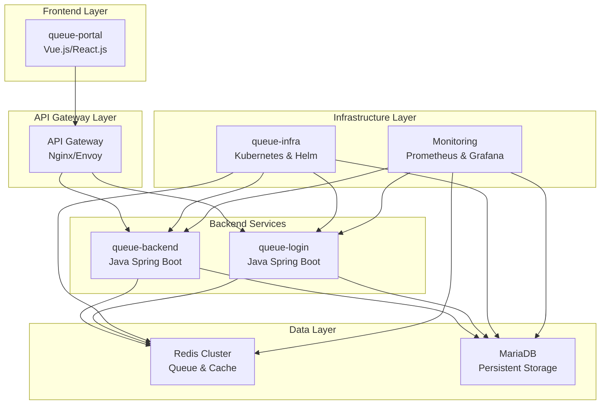
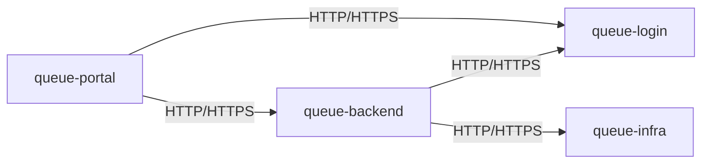
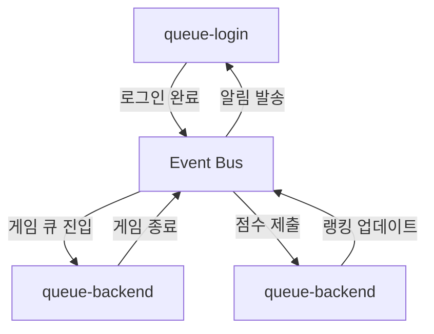
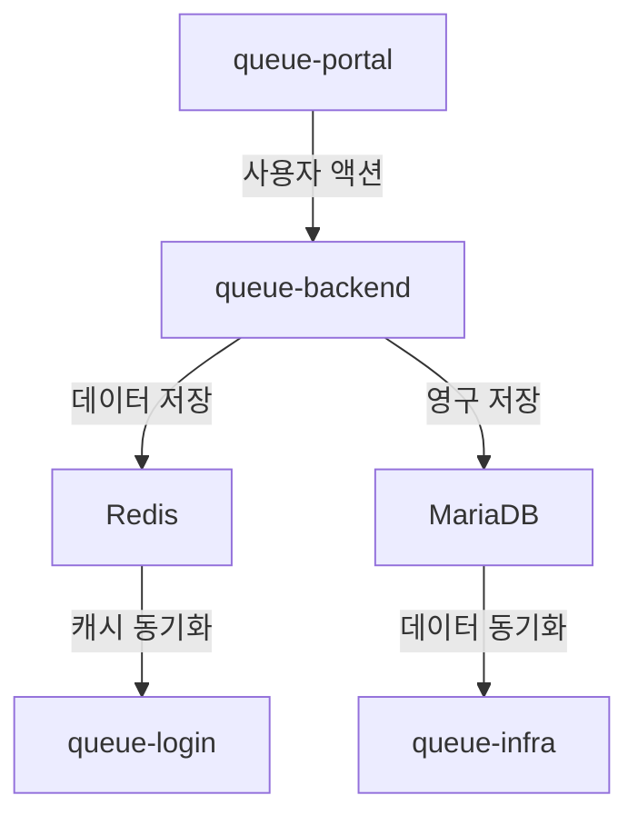
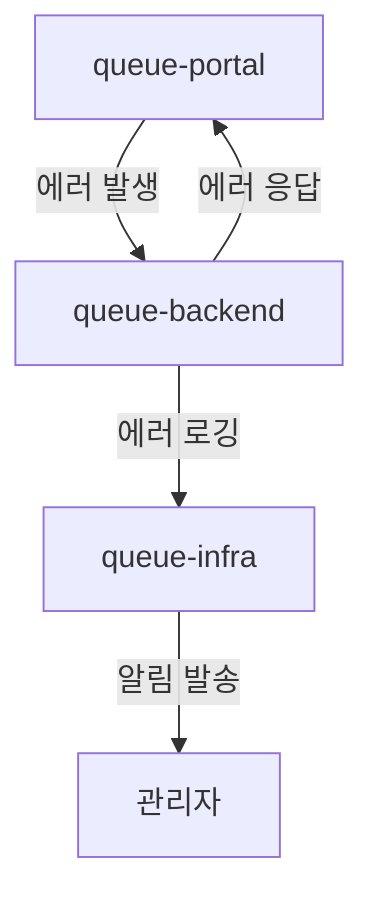

# 🏗️ 프로젝트별 역할 및 책임 가이드

## 📋 목차

### 1. 프로젝트 개요
- [1.1 전체 시스템 구조](#11-전체-시스템-구조)
- [1.2 프로젝트 간 관계](#12-프로젝트-간-관계)
- [1.3 기술 스택](#13-기술-스택)

### 2. queue-portal (프론트엔드)
- [2.1 프로젝트 개요](#21-queue-portal-프로젝트-개요)
- [2.2 주요 기능](#22-주요-기능)
- [2.3 기술 스택](#23-기술-스택)
- [2.4 개발 환경](#24-개발-환경)
- [2.5 배포 및 운영](#25-배포-및-운영)

### 3. queue-backend (백엔드 API)
- [3.1 프로젝트 개요](#31-queue-backend-프로젝트-개요)
- [3.2 주요 기능](#32-주요-기능)
- [3.3 기술 스택](#33-기술-스택)
- [3.4 개발 환경](#34-개발-환경)
- [3.5 배포 및 운영](#35-배포-및-운영)

### 4. queue-login (인증 서비스)
- [4.1 프로젝트 개요](#41-queue-login-프로젝트-개요)
- [4.2 주요 기능](#42-주요-기능)
- [4.3 기술 스택](#43-기술-스택)
- [4.4 개발 환경](#44-개발-환경)
- [4.5 배포 및 운영](#45-배포-및-운영)

### 5. queue-infra (인프라 관리)
- [5.1 프로젝트 개요](#51-queue-infra-프로젝트-개요)
- [5.2 주요 기능](#52-주요-기능)
- [5.3 기술 스택](#53-기술-스택)
- [5.4 개발 환경](#54-개발-환경)
- [5.5 배포 및 운영](#55-배포-및-운영)

### 6. 프로젝트 간 통신
- [6.1 API 통신](#61-api-통신)
- [6.2 이벤트 기반 통신](#62-이벤트-기반-통신)
- [6.3 데이터 동기화](#63-데이터-동기화)
- [6.4 에러 처리](#64-에러-처리)

### 7. 개발 가이드라인
- [7.1 코딩 컨벤션](#71-코딩-컨벤션)
- [7.2 Git 워크플로우](#72-git-워크플로우)
- [7.3 테스트 전략](#73-테스트-전략)
- [7.4 문서화](#74-문서화)

---

## 1. 프로젝트 개요

### 1.1 전체 시스템 구조



### 1.2 프로젝트 간 관계

| 프로젝트 | 역할 | 의존성 | 제공 서비스 |
|---------|------|--------|------------|
| **queue-portal** | 사용자 인터페이스 | queue-backend, queue-login | 웹 포털, 게임 클라이언트 |
| **queue-backend** | 비즈니스 로직 | queue-login, Redis, MariaDB | 큐 관리, 게임 로직, 랭킹 |
| **queue-login** | 인증/인가 | Redis, MariaDB | 사용자 인증, 토큰 관리 |
| **queue-infra** | 인프라 관리 | 모든 프로젝트 | 배포, 모니터링, 장애 대응 |

### 1.3 기술 스택

#### Frontend
- **Framework**: Vue.js 3.x / React.js 18.x
- **Build Tool**: Vite / Webpack
- **UI Library**: Element Plus / Ant Design
- **State Management**: Pinia / Redux Toolkit
- **HTTP Client**: Axios
- **Real-time**: Socket.io-client

#### Backend
- **Language**: Java 17
- **Framework**: Spring Boot 3.x
- **Security**: Spring Security 6.x
- **Database**: MariaDB 10.11
- **Cache**: Redis 7.x
- **Build Tool**: Maven 3.9

#### Infrastructure
- **Container**: Docker
- **Orchestration**: Kubernetes 1.28
- **Package Manager**: Helm 3.x
- **CI/CD**: GitHub Actions
- **Monitoring**: Prometheus, Grafana
- **Logging**: ELK Stack

---

## 2. queue-portal (프론트엔드)

### 2.1 queue-portal 프로젝트 개요

**queue-portal**은 사용자가 큐 시스템과 상호작용하는 웹 기반 포털입니다. 게임 클라이언트, 관리자 대시보드, 사용자 프로필 관리 등의 기능을 제공합니다.

#### 핵심 책임
- 사용자 인터페이스 제공
- 실시간 큐 상태 표시
- 게임 클라이언트 구현
- 관리자 대시보드 운영

### 2.2 주요 기능

#### 사용자 기능
- **로그인/회원가입**: OAuth2, JWT 기반 인증
- **큐 관리**: 로그인, 게임, 랭킹, 포털 큐 상태 조회
- **게임 플레이**: 수박게임 등 미니게임 실행
- **랭킹 조회**: 개인/친구/전체 랭킹 확인
- **프로필 관리**: 사용자 정보 수정, 설정 변경

#### 관리자 기능
- **대시보드**: 실시간 시스템 상태 모니터링
- **사용자 관리**: 사용자 목록, 권한 관리
- **큐 관리**: 큐 상태 조회, 우선순위 조정
- **통계 분석**: 사용량, 성능 지표 분석

#### 게임 클라이언트
- **수박게임**: Matter.js 기반 물리 엔진 퍼즐 게임
- **실시간 매칭**: WebSocket 기반 매칭 시스템
- **점수 시스템**: 실시간 점수 계산 및 전송
- **리플레이**: 게임 기록 저장 및 재생
- **게임 엔진**: Matter.js 기반 2D 물리 엔진
- **Canvas API**: 게임 렌더링
- **Web Audio API**: 사운드 효과

### 2.3 기술 스택

#### Core Technologies
- **Vue.js 3.x**: 컴포지션 API 기반 프론트엔드 프레임워크
- **TypeScript**: 타입 안전성을 위한 정적 타입 언어
- **Vite**: 빠른 개발 서버 및 빌드 도구

#### UI/UX
- **Element Plus**: Vue.js 기반 UI 컴포넌트 라이브러리
- **Tailwind CSS**: 유틸리티 우선 CSS 프레임워크
- **Framer Motion**: 애니메이션 라이브러리

#### State Management
- **Pinia**: Vue.js 상태 관리 라이브러리
- **Vue Router**: 클라이언트 사이드 라우팅

#### Game Development
- **Matter.js**: 2D 물리 엔진
- **Canvas API**: 게임 렌더링
- **Web Audio API**: 사운드 효과

### 2.4 개발 환경

#### 필수 요구사항
- **Node.js**: 18.x 이상
- **npm**: 9.x 이상
- **Git**: 2.x 이상

#### 개발 도구
- **VS Code**: 권장 IDE
- **Vue DevTools**: 브라우저 확장
- **ESLint**: 코드 품질 관리
- **Prettier**: 코드 포맷팅

#### 실행 방법
```bash
# 의존성 설치
npm install

# 개발 서버 실행
npm run dev

# 빌드
npm run build

# 테스트
npm run test
```

### 2.5 배포 및 운영

#### 빌드 및 배포
- **Docker**: 컨테이너화
- **Nginx**: 정적 파일 서빙
- **Kubernetes**: 오케스트레이션
- **Helm**: 패키지 관리

#### 환경 설정
- **Development**: 로컬 개발 환경
- **Staging**: 테스트 환경
- **Production**: 운영 환경

---

## 3. queue-backend (백엔드 API)

### 3.1 queue-backend 프로젝트 개요

**queue-backend**는 큐 시스템의 핵심 비즈니스 로직을 담당하는 REST API 서버입니다. 큐 관리, 게임 로직, 랭킹 시스템 등의 기능을 제공합니다.

#### 핵심 책임
- 큐 시스템 관리
- 게임 로직 처리
- 랭킹 시스템 운영
- 실시간 통신 지원

### 3.2 주요 기능

#### 큐 관리 시스템
- **로그인 큐**: 사용자 인증 대기열 관리
- **게임 큐**: 게임 매칭 시스템
- **랭킹 큐**: 점수 처리 및 랭킹 업데이트
- **포털 큐**: 포털 기능 작업 처리

#### 게임 로직
- **매칭 알고리즘**: ELO 레이팅 기반 매칭
- **게임 세션 관리**: 게임 방 생성 및 관리
- **점수 검증**: 점수 유효성 검사
- **리플레이 시스템**: 게임 기록 저장
- **수박게임 구현**: Matter.js 기반 과일 합치기 게임
- **물리 엔진**: 2D 물리 시뮬레이션
- **점수 시스템**: 과일 크기별 차등 점수, 연쇄 반응 보너스

#### 랭킹 시스템
- **실시간 랭킹**: Redis Sorted Set 기반
- **다양한 랭킹**: 전체, 일일, 주간, 월간
- **친구 랭킹**: 친구 간 랭킹 비교
- **랭킹 알림**: 랭킹 변동 실시간 알림

#### 실시간 통신
- **Server-Sent Events**: 실시간 상태 업데이트
- **WebSocket**: 양방향 실시간 통신
- **이벤트 기반**: 큐 간 이벤트 전파

### 3.3 기술 스택

#### Core Technologies
- **Java 17**: LTS 버전의 Java
- **Spring Boot 3.x**: 마이크로서비스 프레임워크
- **Spring Security 6.x**: 인증 및 인가
- **Spring Data JPA**: 데이터 액세스 계층

#### Database & Cache
- **MariaDB 10.11**: 관계형 데이터베이스
- **Redis 7.x**: 인메모리 데이터베이스
- **HikariCP**: 커넥션 풀

#### Build & Test
- **Maven 3.9**: 빌드 도구
- **JUnit 5**: 단위 테스트
- **Mockito**: 모킹 프레임워크
- **TestContainers**: 통합 테스트

### 3.4 개발 환경

#### 필수 요구사항
- **Java**: 17 이상
- **Maven**: 3.9 이상
- **Docker**: 컨테이너 실행
- **Git**: 2.x 이상

#### 개발 도구
- **IntelliJ IDEA**: 권장 IDE
- **Postman**: API 테스트
- **Redis Desktop Manager**: Redis 관리
- **DBeaver**: 데이터베이스 관리

#### 실행 방법
```bash
# 의존성 설치
mvn clean install

# 애플리케이션 실행
mvn spring-boot:run

# 테스트 실행
mvn test

# 패키징
mvn package
```

### 3.5 배포 및 운영

#### 컨테이너화
- **Docker**: 멀티 스테이지 빌드
- **Jib**: 컨테이너 이미지 빌드
- **Health Check**: 애플리케이션 상태 확인

#### Kubernetes 배포
- **Deployment**: 애플리케이션 배포
- **Service**: 서비스 노출
- **ConfigMap**: 설정 관리
- **Secret**: 민감 정보 관리

---

## 4. queue-login (인증 서비스)

### 4.1 queue-login 프로젝트 개요

**queue-login**은 사용자 인증 및 인가를 전담하는 마이크로서비스입니다. JWT 기반 인증, 사용자 관리, 권한 제어 등의 기능을 제공합니다.

#### 핵심 책임
- 사용자 인증 처리
- JWT 토큰 관리
- 사용자 정보 관리
- 권한 제어

### 4.2 주요 기능

#### 인증 시스템
- **회원가입**: 사용자 등록 및 검증
- **로그인**: 사용자 인증 및 토큰 발급
- **토큰 갱신**: Refresh Token 기반 갱신
- **로그아웃**: 토큰 무효화

#### 사용자 관리
- **프로필 관리**: 사용자 정보 CRUD
- **권한 관리**: 역할 기반 권한 제어
- **상태 관리**: 사용자 계정 상태 관리
- **보안 정책**: 비밀번호 정책, 계정 잠금
- **그룹 관리**: 사용자 그룹 분류 및 관리

#### 토큰 관리
- **JWT 생성**: Access Token, Refresh Token
- **토큰 검증**: 서명 및 만료 시간 확인
- **토큰 갱신**: 자동 갱신 로직
- **토큰 무효화**: 블랙리스트 관리

### 4.3 기술 스택

#### Core Technologies
- **Java 17**: 프로그래밍 언어
- **Spring Boot 3.x**: 웹 프레임워크
- **Spring Security 6.x**: 보안 프레임워크
- **Spring Data JPA**: 데이터 액세스

#### Security
- **JWT**: JSON Web Token
- **BCrypt**: 비밀번호 암호화
- **OAuth2**: 인증 프로토콜
- **CORS**: 크로스 오리진 리소스 공유

#### Database
- **MariaDB**: 사용자 정보 저장
- **Redis**: 토큰 캐싱 및 세션 관리

### 4.4 개발 환경

#### 필수 요구사항
- **Java**: 17 이상
- **Maven**: 3.9 이상
- **Docker**: 컨테이너 실행
- **Git**: 2.x 이상

#### 개발 도구
- **IntelliJ IDEA**: 권장 IDE
- **Postman**: API 테스트
- **JWT.io**: 토큰 디버깅
- **Redis CLI**: Redis 관리

#### 실행 방법
```bash
# 의존성 설치
mvn clean install

# 애플리케이션 실행
mvn spring-boot:run

# 테스트 실행
mvn test

# 패키징
mvn package
```

### 4.5 배포 및 운영

#### 보안 설정
- **HTTPS**: SSL/TLS 암호화
- **Rate Limiting**: 요청 제한
- **CORS**: 도메인 제한
- **Audit Log**: 보안 로그

#### 모니터링
- **Health Check**: 서비스 상태 확인
- **Metrics**: 성능 지표 수집
- **Logging**: 구조화된 로그
- **Alerting**: 이상 상황 알림

---

## 5. queue-infra (인프라 관리)

### 5.1 queue-infra 프로젝트 개요

**queue-infra**는 전체 시스템의 인프라스트럭처를 관리하는 프로젝트입니다. Kubernetes, Helm, 모니터링, 장애 대응 등의 기능을 담당합니다.

#### 핵심 책임
- 인프라스트럭처 관리
- 애플리케이션 배포
- 모니터링 및 알림
- 장애 대응 및 복구

### 5.2 주요 기능

#### Kubernetes 관리
- **클러스터 관리**: 노드, 네임스페이스 관리
- **워크로드 관리**: Pod, Deployment, Service 관리
- **네트워크 관리**: Ingress, NetworkPolicy 설정
- **스토리지 관리**: PVC, StorageClass 관리

#### Helm 차트 관리
- **애플리케이션 패키징**: Helm 차트 생성 및 관리
- **환경별 배포**: dev, staging, prod 환경 분리
- **설정 관리**: values.yaml을 통한 설정 관리
- **버전 관리**: 차트 버전 관리 및 롤백

#### 데이터베이스 관리
- **MariaDB**: Primary-Replica 구성
- **Redis**: 클러스터 구성
- **백업 및 복구**: 정기 백업 및 복구 시스템
- **모니터링**: 데이터베이스 성능 모니터링

#### K6 성능 테스트
- **부하 테스트**: 사용자 시나리오 기반 테스트
- **성능 측정**: 응답 시간, 처리량 측정
- **스트레스 테스트**: 시스템 한계점 파악
- **자동화**: CI/CD 파이프라인 통합
- **대용량 테스트**: 10만명 동시 접속 시뮬레이션
- **Redis 큐 테스트**: 큐 시스템 성능 검증
- **실시간 통신 테스트**: SSE/WebSocket 부하 테스트

#### ArgoCD GitOps
- **자동 배포**: Git 기반 자동 배포
- **환경 동기화**: Git과 클러스터 상태 동기화
- **롤백**: 이전 버전으로 자동 롤백
- **감사**: 배포 이력 추적

### 5.3 기술 스택

#### Container & Orchestration
- **Docker**: 컨테이너 런타임
- **Kubernetes**: 컨테이너 오케스트레이션
- **Helm**: 패키지 관리자
- **ArgoCD**: GitOps 도구

#### Monitoring & Logging
- **Prometheus**: 메트릭 수집
- **Grafana**: 대시보드 및 시각화
- **ELK Stack**: 로그 수집 및 분석
- **Jaeger**: 분산 추적

#### CI/CD
- **GitHub Actions**: CI/CD 파이프라인
- **Docker Registry**: 이미지 저장소
- **Kustomize**: 설정 관리
- **Skaffold**: 개발 환경 도구

#### Performance Testing
- **K6**: 성능 테스트 도구
- **JMeter**: 부하 테스트
- **Gatling**: 스트레스 테스트
- **Artillery**: API 테스트

### 5.4 개발 환경

#### 필수 요구사항
- **kubectl**: Kubernetes CLI
- **helm**: Helm CLI
- **docker**: Docker CLI
- **git**: Git CLI

#### 개발 도구
- **VS Code**: 권장 IDE
- **k9s**: Kubernetes 관리 도구
- **Lens**: Kubernetes IDE
- **Rancher**: 클러스터 관리

#### 실행 방법
```bash
# 클러스터 연결 확인
kubectl cluster-info

# Helm 차트 설치
helm install queue-system ./charts/queue-system

# 애플리케이션 배포
kubectl apply -f manifests/

# 모니터링 확인
kubectl port-forward svc/grafana 3000:80
```

### 5.5 배포 및 운영

#### 환경별 배포
- **Development**: 개발 환경
- **Staging**: 테스트 환경
- **Production**: 운영 환경

#### 모니터링 대시보드
- **시스템 메트릭**: CPU, 메모리, 네트워크
- **애플리케이션 메트릭**: 응답 시간, 에러율
- **비즈니스 메트릭**: 사용자 수, 큐 길이
- **알림**: 임계값 기반 알림

---

## 6. 프로젝트 간 통신

### 6.1 API 통신

#### REST API


#### API 명세
- **queue-backend**: `/api/queue/**`, `/api/game/**`, `/api/ranking/**`
- **queue-login**: `/api/auth/**`, `/api/user/**`
- **queue-infra**: `/api/monitoring/**`, `/api/admin/**`

### 6.2 이벤트 기반 통신

#### 이벤트 스트림


#### 이벤트 타입
- **사용자 이벤트**: 로그인, 로그아웃, 회원가입
- **큐 이벤트**: 큐 진입, 큐 퇴장, 큐 완료
- **게임 이벤트**: 매칭 완료, 게임 시작, 게임 종료
- **랭킹 이벤트**: 점수 제출, 랭킹 업데이트

### 6.3 데이터 동기화

#### 데이터 흐름


#### 동기화 전략
- **실시간 동기화**: Redis Pub/Sub
- **배치 동기화**: 정기적인 데이터 동기화
- **이벤트 동기화**: 이벤트 기반 데이터 업데이트

### 6.4 에러 처리

#### 에러 전파


#### 에러 처리 전략
- **재시도**: 자동 재시도 로직
- **서킷 브레이커**: 연쇄 장애 방지
- **폴백**: 대체 서비스 제공
- **모니터링**: 실시간 에러 추적

---

## 7. 개발 가이드라인

### 7.1 코딩 컨벤션

#### Java (Backend)
```java
// 클래스명: PascalCase
public class QueueService {
    
    // 메서드명: camelCase
    public void processQueue() {
        // 변수명: camelCase
        String queueName = "login_queue";
        
        // 상수명: UPPER_SNAKE_CASE
        private static final int MAX_RETRY_COUNT = 3;
    }
}
```

#### TypeScript (Frontend)
```typescript
// 인터페이스명: PascalCase
interface QueueStatus {
    // 속성명: camelCase
    position: number;
    estimatedWaitTime: number;
}

// 함수명: camelCase
const processQueue = (): void => {
    // 변수명: camelCase
    const queueName = 'login_queue';
    
    // 상수명: UPPER_SNAKE_CASE
    const MAX_RETRY_COUNT = 3;
};
```

### 7.2 Git 워크플로우

#### 브랜치 전략
- **main**: 운영 환경 배포
- **develop**: 개발 환경 배포
- **feature/**: 기능 개발
- **hotfix/**: 긴급 수정

#### 커밋 메시지
```
feat: 새로운 기능 추가
fix: 버그 수정
docs: 문서 수정
style: 코드 포맷팅
refactor: 코드 리팩토링
test: 테스트 추가
chore: 빌드 설정 변경
```

### 7.3 테스트 전략

#### 단위 테스트
- **Backend**: JUnit 5 + Mockito
- **Frontend**: Jest + Vue Test Utils
- **Coverage**: 80% 이상

#### 통합 테스트
- **API 테스트**: Postman/Newman
- **E2E 테스트**: Playwright
- **성능 테스트**: K6

### 7.4 문서화

#### API 문서
- **Swagger/OpenAPI**: API 명세
- **Postman Collection**: API 테스트
- **README**: 프로젝트 가이드

#### 코드 문서
- **JavaDoc**: Java 코드 문서
- **JSDoc**: TypeScript 코드 문서
- **주석**: 복잡한 로직 설명

---

## 📊 프로젝트별 메트릭

### 개발 생산성
- **코드 커버리지**: 80% 이상
- **빌드 시간**: 5분 이내
- **배포 시간**: 10분 이내
- **버그 수정 시간**: 24시간 이내

### 시스템 성능
- **API 응답 시간**: 100ms 이내
- **페이지 로드 시간**: 2초 이내
- **가용성**: 99.9% 이상
- **에러율**: 0.1% 이하

### 운영 효율성
- **자동화율**: 90% 이상
- **모니터링 커버리지**: 100%
- **장애 복구 시간**: 5분 이내
- **보안 취약점**: 0개

---

## 🔧 개발 도구 및 리소스

### 필수 도구
- **IDE**: IntelliJ IDEA, VS Code
- **버전 관리**: Git, GitHub
- **컨테이너**: Docker, Kubernetes
- **모니터링**: Prometheus, Grafana

### 유용한 리소스
- **문서**: 프로젝트 README, API 문서
- **가이드**: 개발 가이드, 배포 가이드
- **템플릿**: 코드 템플릿, 설정 템플릿
- **도구**: 스크립트, 유틸리티

### 학습 자료
- **공식 문서**: Spring Boot, Vue.js, Kubernetes
- **온라인 강의**: Udemy, Coursera
- **커뮤니티**: Stack Overflow, GitHub
- **블로그**: 기술 블로그, 튜토리얼
