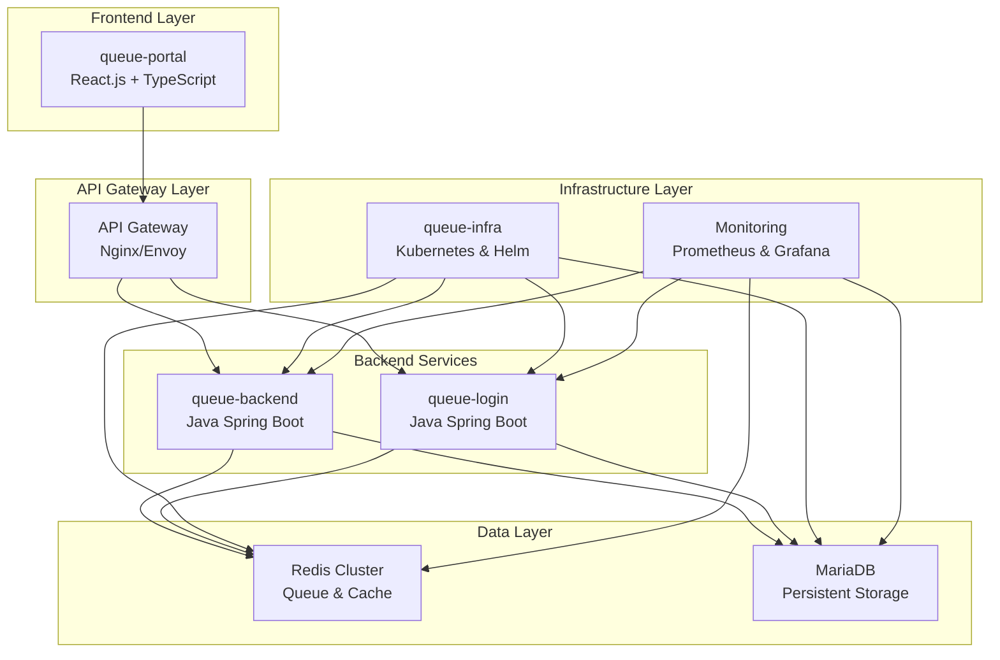
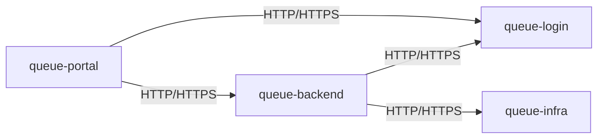
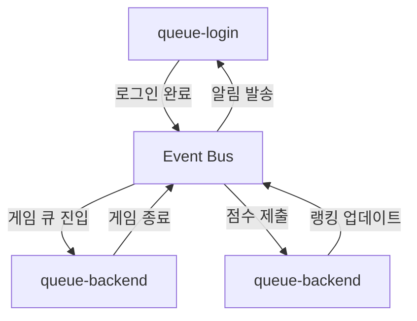
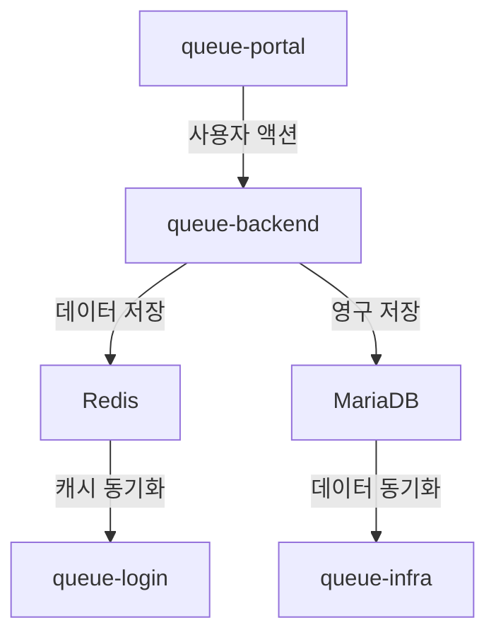

# 🏗️ Queue System 프로젝트 개요

## 📋 목차

### 1. 프로젝트 개요
- [1.1 전체 시스템 구조](#11-전체-시스템-구조)
- [1.2 프로젝트 간 관계](#12-프로젝트-간-관계)
- [1.3 기술 스택](#13-기술-스택)
- [1.4 개발 일정](#14-개발-일정)

### 2. 프로젝트별 상세 정보
- [2.1 queue-portal (프론트엔드)](#21-queue-portal-프론트엔드)
- [2.2 queue-backend (백엔드 API)](#22-queue-backend-백엔드-api)
- [2.3 queue-login (인증 서비스)](#23-queue-login-인증-서비스)
- [2.4 queue-infra (인프라 관리)](#24-queue-infra-인프라-관리)

### 3. 개발 계획
- [3.1 Phase 1: 기본 인프라 및 핵심 기능](#31-phase-1-기본-인프라-및-핵심-기능)
- [3.2 Phase 2: 실시간 기능 및 고급 큐잉](#32-phase-2-실시간-기능-및-고급-큐잉)
- [3.3 Phase 3: 고급 기능 및 최적화](#33-phase-3-고급-기능-및-최적화)
- [3.4 Phase 4: 확장 및 운영 준비](#34-phase-4-확장-및-운영-준비)

### 4. 프로젝트 간 통신
- [4.1 API 통신](#41-api-통신)
- [4.2 이벤트 기반 통신](#42-이벤트-기반-통신)
- [4.3 데이터 동기화](#43-데이터-동기화)

### 5. 개발 가이드라인
- [5.1 코딩 컨벤션](#51-코딩-컨벤션)
- [5.2 Git 워크플로우](#52-git-워크플로우)
- [5.3 테스트 전략](#53-테스트-전략)

---

## 1. 프로젝트 개요

### 1.1 전체 시스템 구조



### 1.2 프로젝트 간 관계

| 프로젝트 | 역할 | 담당자 | 의존성 | 제공 서비스 |
|---------|------|--------|--------|------------|
| **queue-portal** | 사용자 인터페이스 | A대리님 | queue-backend, queue-login | 웹 포털, 게임 클라이언트 |
| **queue-backend** | 비즈니스 로직 | 과장님 | queue-login, Redis, MariaDB | 큐 관리, 게임 로직, 랭킹 |
| **queue-login** | 인증/인가 | 차장님 | Redis, MariaDB | 사용자 인증, 토큰 관리 |
| **queue-infra** | 인프라 관리 | B대리님 | 모든 프로젝트 | 배포, 모니터링, 장애 대응 |

### 1.3 기술 스택

#### Frontend
- **Framework**: React.js 18.x
- **Language**: TypeScript
- **Build Tool**: Vite
- **UI Library**: Tailwind CSS, Headless UI
- **State Management**: Zustand
- **HTTP Client**: Axios
- **Real-time**: Socket.io-client

#### Backend
- **Language**: Java 17
- **Framework**: Spring Boot 3.x
- **Security**: Spring Security 6.x
- **Database**: MariaDB 10.11
- **Cache**: Redis 7.x
- **Build Tool**: Maven 3.9

#### Infrastructure
- **Container**: Docker
- **Orchestration**: Kubernetes 1.28
- **Package Manager**: Helm 3.x
- **CI/CD**: GitHub Actions
- **Monitoring**: Prometheus, Grafana
- **Logging**: ELK Stack

### 1.4 개발 일정

| Phase | 기간 | 주요 목표 | 완료율 |
|-------|------|-----------|--------|
| Phase 1 | 1주 | 기본 인프라 및 핵심 기능 | 0% |
| Phase 2 | 1주 | 실시간 기능 및 고급 큐잉 | 0% |
| Phase 3 | 1주 | 고급 기능 및 최적화 | 0% |
| Phase 4 | 1주 | 확장 및 운영 준비 | 0% |
| **총 기간** | **4주** | **완전한 큐 시스템 구축** | **0%** |

**프로젝트 마감일**: 2025년 9월 20일

---

## 2. 프로젝트별 상세 정보

### 2.1 queue-portal (프론트엔드)

**담당자**: A대리님

#### 핵심 책임
- 사용자 인터페이스 제공
- 실시간 큐 상태 표시
- 게임 클라이언트 구현
- 관리자 대시보드 운영

#### 주요 기능
- **사용자 기능**: 로그인/회원가입, 큐 관리, 게임 플레이, 랭킹 조회, 프로필 관리
- **관리자 기능**: 대시보드, 사용자 관리, 큐 관리, 통계 분석
- **게임 클라이언트**: 수박게임, 실시간 매칭, 점수 시스템, 리플레이

#### 기술 스택
- **React.js 18.x**: 컴포넌트 기반 UI 프레임워크
- **TypeScript**: 타입 안전성
- **Vite**: 빠른 개발 서버 및 빌드 도구
- **Tailwind CSS**: 유틸리티 우선 CSS 프레임워크
- **Headless UI**: 접근성 우선 UI 컴포넌트
- **Zustand**: 상태 관리
- **Socket.io-client**: 실시간 통신

### 2.2 queue-backend (백엔드 API)

**담당자**: 과장님

#### 핵심 책임
- 큐 시스템 관리
- 게임 로직 처리
- 랭킹 시스템 운영
- 실시간 통신 지원

#### 주요 기능
- **큐 관리 시스템**: 로그인 큐, 게임 큐, 랭킹 큐, 포털 큐
- **게임 로직**: 매칭 알고리즘, 게임 세션 관리, 점수 검증, 리플레이 시스템
- **랭킹 시스템**: 실시간 랭킹, 다양한 랭킹, 친구 랭킹, 랭킹 알림
- **실시간 통신**: Server-Sent Events, WebSocket, 이벤트 기반

#### 기술 스택
- **Java 17**: LTS 버전의 Java
- **Spring Boot 3.x**: 마이크로서비스 프레임워크
- **Spring Security 6.x**: 인증 및 인가
- **Spring Data JPA**: 데이터 액세스 계층
- **MariaDB 10.11**: 관계형 데이터베이스
- **Redis 7.x**: 인메모리 데이터베이스

### 2.3 queue-login (인증 서비스)

**담당자**: 차장님

#### 핵심 책임
- 사용자 인증 처리
- JWT 토큰 관리
- 사용자 정보 관리
- 권한 제어

#### 주요 기능
- **인증 시스템**: 회원가입, 로그인, 토큰 갱신, 로그아웃
- **사용자 관리**: 프로필 관리, 권한 관리, 상태 관리, 보안 정책
- **토큰 관리**: JWT 생성, 토큰 검증, 토큰 갱신, 토큰 무효화

#### 기술 스택
- **Java 17**: 프로그래밍 언어
- **Spring Boot 3.x**: 웹 프레임워크
- **Spring Security 6.x**: 보안 프레임워크
- **JWT**: JSON Web Token
- **BCrypt**: 비밀번호 암호화
- **MariaDB**: 사용자 정보 저장
- **Redis**: 토큰 캐싱 및 세션 관리

### 2.4 queue-infra (인프라 관리)

**담당자**: B대리님

#### 핵심 책임
- 인프라스트럭처 관리
- 애플리케이션 배포
- 모니터링 및 알림
- 장애 대응 및 복구

#### 주요 기능
- **Kubernetes 관리**: 클러스터 관리, 워크로드 관리, 네트워크 관리, 스토리지 관리
- **Helm 차트 관리**: 애플리케이션 패키징, 환경별 배포, 설정 관리, 버전 관리
- **데이터베이스 관리**: MariaDB Primary-Replica 구성, Redis 클러스터 구성, 백업 및 복구
- **K6 성능 테스트**: 부하 테스트, 성능 측정, 스트레스 테스트, 자동화
- **ArgoCD GitOps**: 자동 배포, 환경 동기화, 롤백, 감사

#### 기술 스택
- **Docker**: 컨테이너 런타임
- **Kubernetes**: 컨테이너 오케스트레이션
- **Helm**: 패키지 관리자
- **ArgoCD**: GitOps 도구
- **Prometheus**: 메트릭 수집
- **Grafana**: 대시보드 및 시각화
- **K6**: 성능 테스트 도구

---

## 3. 개발 계획

### 3.1 Phase 1: 기본 인프라 및 핵심 기능 (1주)

#### 1.1 인프라 구축
- **Kubernetes 환경 설정**: 기본 K8s 클러스터 구성
- **Helm 차트 생성**: 각 서비스별 Helm 차트 작성
- **데이터베이스 설정**: MariaDB, Redis 클러스터 구성
- **모니터링 설정**: Prometheus, Grafana 기본 설정

#### 1.2 기본 API 개발
- **queue-login**: 사용자 인증 API 개발
- **queue-backend**: 기본 큐 관리 API 개발
- **queue-portal**: 기본 UI 컴포넌트 개발

#### 1.3 기본 통합
- **API 연동**: 프론트엔드-백엔드 연동
- **데이터베이스 연동**: JPA 설정 및 기본 CRUD
- **기본 테스트**: 단위 테스트 및 통합 테스트

### 3.2 Phase 2: 실시간 기능 및 고급 큐잉 (1주)

#### 2.1 실시간 통신
- **WebSocket 구현**: 실시간 큐 상태 업데이트
- **Server-Sent Events**: 큐 진행 상황 실시간 전송
- **이벤트 기반 아키텍처**: 서비스 간 이벤트 통신

#### 2.2 고급 큐 기능
- **우선순위 큐**: VIP/일반 사용자 구분
- **동적 큐 관리**: 트래픽에 따른 큐 활성화/비활성화
- **큐 상태 모니터링**: 실시간 큐 상태 대시보드

#### 2.3 게임 기능
- **수박게임 구현**: Matter.js 기반 게임 엔진
- **매칭 시스템**: ELO 레이팅 기반 매칭
- **점수 시스템**: 실시간 점수 계산 및 전송

### 3.3 Phase 3: 고급 기능 및 최적화 (1주)

#### 3.1 성능 최적화
- **Redis 최적화**: 메모리 사용량 최적화, 파이프라인 구현
- **데이터베이스 최적화**: 인덱스 최적화, 쿼리 성능 개선
- **캐싱 전략**: 다단계 캐싱 시스템 구현

#### 3.2 고급 기능
- **랭킹 시스템**: 실시간 랭킹, 다양한 랭킹 타입
- **통계 및 분석**: 사용량 통계, 성능 분석
- **관리자 기능**: 사용자 관리, 시스템 설정

#### 3.3 보안 강화
- **인증 보안**: JWT 보안 강화, 토큰 갱신 로직
- **API 보안**: Rate Limiting, CORS 설정
- **데이터 보안**: 민감 정보 암호화

### 3.4 Phase 4: 확장 및 운영 준비 (1주)

#### 4.1 확장성 준비
- **수평 확장**: Kubernetes HPA 설정
- **로드 밸런싱**: 트래픽 분산 최적화
- **데이터베이스 확장**: 샤딩, 읽기 전용 복제본

#### 4.2 운영 도구
- **모니터링**: 상세 메트릭 수집, 알림 설정
- **로깅**: 구조화된 로그, 로그 분석
- **백업**: 자동 백업 시스템, 재해 복구

#### 4.3 성능 테스트
- **K6 테스트**: 대용량 트래픽 시뮬레이션
- **스트레스 테스트**: 시스템 한계점 파악
- **최적화**: 성능 병목 지점 개선

---

## 4. 프로젝트 간 통신

### 4.1 API 통신

#### REST API


#### API 명세
- **queue-backend**: `/api/queue/**`, `/api/game/**`, `/api/ranking/**`
- **queue-login**: `/api/auth/**`, `/api/user/**`
- **queue-infra**: `/api/monitoring/**`, `/api/admin/**`

### 4.2 이벤트 기반 통신

#### 이벤트 스트림


#### 이벤트 타입
- **사용자 이벤트**: 로그인, 로그아웃, 회원가입
- **큐 이벤트**: 큐 진입, 큐 퇴장, 큐 완료
- **게임 이벤트**: 매칭 완료, 게임 시작, 게임 종료
- **랭킹 이벤트**: 점수 제출, 랭킹 업데이트

### 4.3 데이터 동기화

#### 데이터 흐름


#### 동기화 전략
- **실시간 동기화**: Redis Pub/Sub
- **배치 동기화**: 정기적인 데이터 동기화
- **이벤트 동기화**: 이벤트 기반 데이터 업데이트

---

## 5. 개발 가이드라인

### 5.1 코딩 컨벤션

#### Java (Backend)
```java
// 클래스명: PascalCase
public class QueueService {
    
    // 메서드명: camelCase
    public void processQueue() {
        // 변수명: camelCase
        String queueName = "login_queue";
        
        // 상수명: UPPER_SNAKE_CASE
        private static final int MAX_RETRY_COUNT = 3;
    }
}
```

#### TypeScript (Frontend)
```typescript
// 인터페이스명: PascalCase
interface QueueStatus {
    // 속성명: camelCase
    position: number;
    estimatedWaitTime: number;
}

// 함수명: camelCase
const processQueue = (): void => {
    // 변수명: camelCase
    const queueName = 'login_queue';
    
    // 상수명: UPPER_SNAKE_CASE
    const MAX_RETRY_COUNT = 3;
};
```

### 5.2 Git 워크플로우

#### 브랜치 전략
- **main**: 운영 환경 배포
- **develop**: 개발 환경 배포
- **feature/**: 기능 개발
- **hotfix/**: 긴급 수정

#### 커밋 메시지
```
feat: 새로운 기능 추가
fix: 버그 수정
docs: 문서 수정
style: 코드 포맷팅
refactor: 코드 리팩토링
test: 테스트 추가
chore: 빌드 설정 변경
```

### 5.3 테스트 전략

#### 단위 테스트
- **Backend**: JUnit 5 + Mockito
- **Frontend**: Jest + React Testing Library
- **Coverage**: 80% 이상

#### 통합 테스트
- **API 테스트**: Postman/Newman
- **E2E 테스트**: Playwright
- **성능 테스트**: K6

---

## 📊 프로젝트 목표

### 성능 목표
- **대용량 트래픽**: 10만명 동시 접속 처리
- **응답 시간**: API 응답 시간 200ms 이내
- **가용성**: 99.9% 이상
- **에러율**: 0.1% 이하

### 개발 목표
- **코드 커버리지**: 80% 이상
- **빌드 시간**: 5분 이내
- **배포 시간**: 10분 이내
- **버그 수정 시간**: 24시간 이내

### 운영 목표
- **자동화율**: 90% 이상
- **모니터링 커버리지**: 100%
- **장애 복구 시간**: 5분 이내
- **보안 취약점**: 0개

---

## 🔧 개발 도구 및 리소스

### 필수 도구
- **IDE**: IntelliJ IDEA, VS Code
- **버전 관리**: Git, GitHub
- **컨테이너**: Docker, Kubernetes
- **모니터링**: Prometheus, Grafana

### 유용한 리소스
- **문서**: 프로젝트 README, API 문서
- **가이드**: 개발 가이드, 배포 가이드
- **템플릿**: 코드 템플릿, 설정 템플릿
- **도구**: 스크립트, 유틸리티

### 학습 자료
- **공식 문서**: Spring Boot, React.js, Kubernetes
- **온라인 강의**: Udemy, Coursera
- **커뮤니티**: Stack Overflow, GitHub
- **블로그**: 기술 블로그, 튜토리얼
