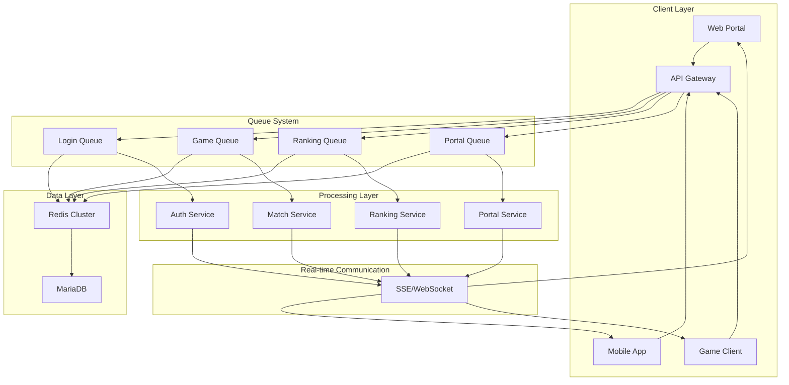
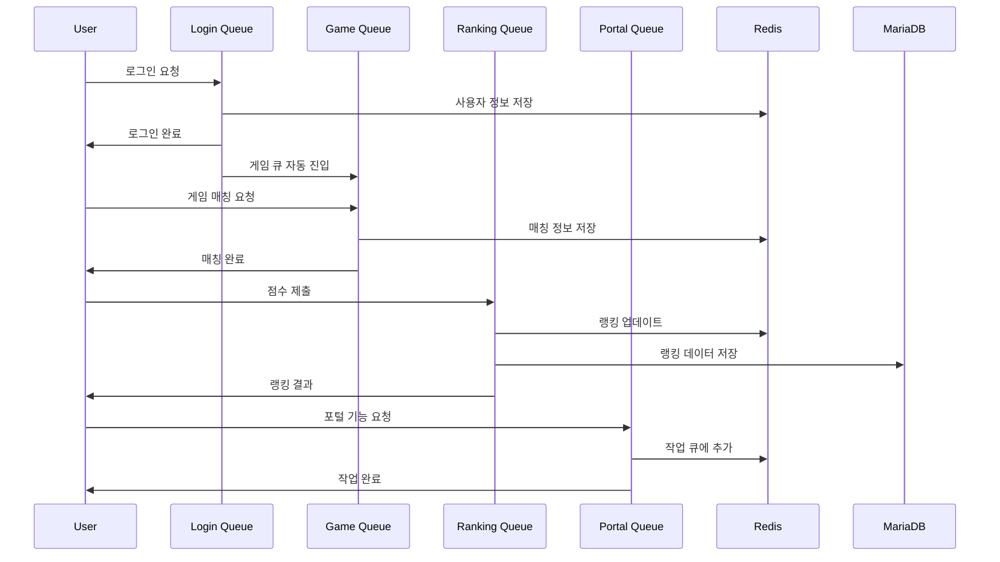
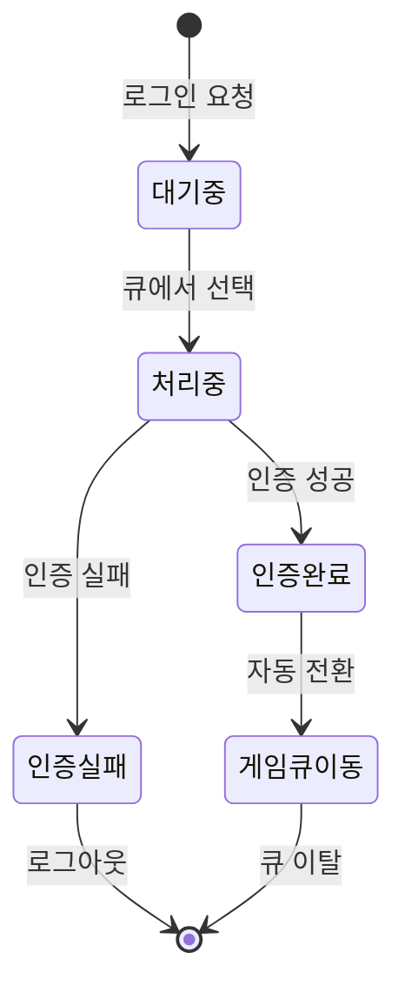
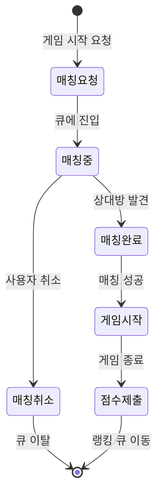
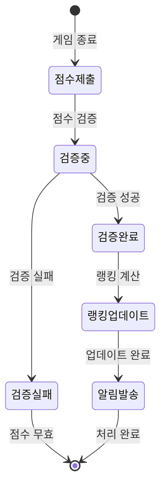
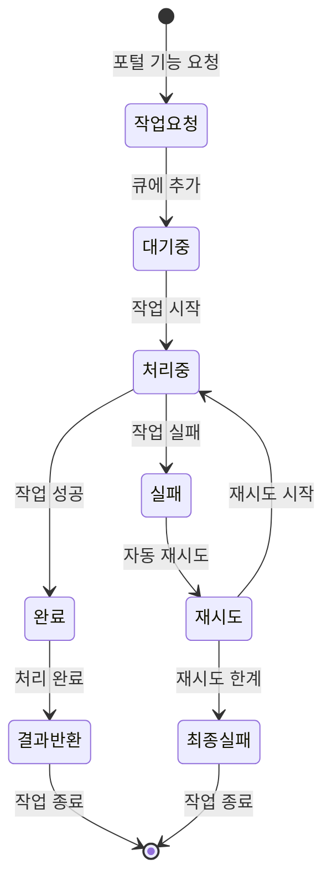

# 🚀 Queue System - 대용량 로그인 큐잉 시스템

## 🚀 전체 개요

10만명이 동시에(1분 이내) 접속하여 로그인을 시도하는 대용량 트래픽을 처리하는 **Redis 기반 큐잉 시스템**입니다. 마이크로서비스 아키텍처로 구성되어 있으며, 각 서비스는 독립적으로 개발, 배포, 확장이 가능합니다.

### 🎯 핵심 목표
- **대용량 트래픽 처리**: 10만명 동시 접속 (1분 이내)
- **Redis 기반 큐잉**: 고성능 대기열 시스템으로 안정적인 처리
- **실시간 통신**: SSE + WebSocket을 통한 실시간 상태 업데이트
- **마이크로서비스**: 독립적이고 확장 가능한 서비스 구성
- **Kubernetes 배포**: 클라우드 네이티브 환경에서의 자동화된 배포

## 🏗️ 시스템 아키텍처

```
┌─────────────────────────────────────────────────────────────────┐
│                        Queue System                             │
├─────────────────────────────────────────────────────────────────┤
│  ┌─────────────┐  ┌─────────────┐  ┌─────────────┐              │
│  │   Portal    │  │   Backend   │  │    Login    │              │
│  │ (Frontend)  │  │   (API)     │  │ (Auth API)  │              │
│  └─────────────┘  └─────────────┘  └─────────────┘              │
│                                                               │
│  ┌─────────────┐  ┌─────────────┐  ┌─────────────┐              │
│  │   Infra     │  │    Redis    │  │   MariaDB   │              │
│  │ (K8s/Helm)  │  │ (Queue+DB)  │  │ (Metadata)  │              │
│  └─────────────┘  └─────────────┘  └─────────────┘              │
└─────────────────────────────────────────────────────────────────┘
```

## 📦 프로젝트 구성

### 1. **queue-portal** - 프론트엔드 포털
- **역할**: 사용자 인터페이스 및 실시간 대기열 시각화
- **기술**: Vue.js/React.js, SSE 클라이언트, WebSocket 클라이언트
- **주요 기능**:
  - 실시간 큐 상태 표시
  - 수박게임 (Matter.js 기반)
  - 실시간 랭킹 시스템
  - 반응형 UI/UX

### 2. **queue-backend** - 백엔드 API 서버
- **역할**: 다중 큐 관리, 게임 로직, 실시간 통신 처리
- **기술**: Java 17, Spring Boot 3.x, Redis, SSE, WebSocket
- **주요 기능**:
  - **로그인 큐 시스템**: 10만명 동시 로그인 처리
  - **게임 큐 시스템**: 게임 매칭 및 대기열 관리
  - **랭킹 큐 시스템**: 실시간 랭킹 업데이트 및 처리
  - **통합 큐 관리**: 다중 큐 간 우선순위 및 리소스 분배
  - SSE/WebSocket 실시간 통신
  - API 엔드포인트 제공

### 3. **queue-login** - 인증 서비스
- **역할**: 사용자 인증, 회원가입, 토큰 관리
- **기술**: Java 17, Spring Boot 3.x, Spring Security, JWT
- **주요 기능**:
  - JWT 기반 인증
  - 사용자 관리 (CRUD)
  - 보안 정책 적용
  - 외부 인증 시스템 연동 준비

### 4. **queue-infra** - 인프라 관리
- **역할**: Kubernetes 배포, 데이터베이스 관리, 성능 테스트, GitOps
- **기술**: Kubernetes, Helm, K6, ArgoCD, MariaDB, Redis
- **주요 기능**:
  - Helm 차트 기반 배포 자동화
  - MariaDB 데이터베이스 관리 (Primary + Read Replica)
  - Redis 클러스터 관리 (6노드 클러스터)
  - K6 성능 테스트 및 부하 테스트
  - ArgoCD GitOps 연동 및 자동 배포

## 🔄 Queue 기능 및 위치

### 큐잉 시스템의 핵심 역할
1. **로그인 큐**: 사용자 로그인 시도 시 대기열 관리 (10만명 동시 처리)
2. **게임 큐**: 수박게임 플레이 시 매칭 및 순서 관리
3. **랭킹 큐**: 실시간 랭킹 업데이트 및 점수 처리
4. **포털 큐**: 다양한 포털 기능 접근 시 대기열 활용
5. **통합 큐 관리**: 다중 큐 간 우선순위 및 리소스 분배

### 각 프로젝트별 Queue 기능

#### queue-backend
- **다중 큐 관리 시스템**:
  - **로그인 큐**: `LoginQueueService` - 10만명 동시 로그인 처리
  - **게임 큐**: `GameQueueService` - 게임 매칭 및 대기열 관리
  - **랭킹 큐**: `RankingQueueService` - 실시간 랭킹 업데이트 처리
  - **통합 큐 관리**: `QueueManagerService` - 다중 큐 간 우선순위 및 리소스 분배
- **Redis 큐 아키텍처**:
  - **로그인 큐**: Redis Sorted Set (우선순위 기반)
  - **게임 큐**: Redis List (FIFO + 매칭 로직)
  - **랭킹 큐**: Redis Sorted Set (점수 기반 정렬)
  - **큐 메타데이터**: Redis Hash (큐 상태, 통계 정보)
- **실시간 상태 브로드캐스트**: SSE/WebSocket을 통한 다중 큐 상태 전송
- **게임 데이터 처리**: 랭킹, 점수, 통계, 매칭 로직 관리

#### queue-portal
- **큐 상태 시각화**: 실시간 대기열 UI 컴포넌트
- **게임 인터페이스**: 수박게임을 통한 큐 시스템 활용 예시
- **실시간 업데이트**: SSE/WebSocket 클라이언트

#### queue-login
- **인증 후 큐 진입**: 로그인 성공 시 큐 시스템으로 전달
- **사용자 역할 기반 우선순위**: VIP, 프리미엄, 일반 사용자 구분

#### queue-infra
- **성능 테스트**: K6를 통한 큐 시스템 부하 테스트
- **데이터베이스 관리**: MariaDB Primary + Read Replica 구성
- **Redis 관리**: 6노드 클러스터 구성 및 모니터링
- **GitOps 관리**: ArgoCD를 통한 자동 배포 및 동기화

## 🎯 다중 큐 관리 시스템 상세

### 큐 시스템 개요

Queue System은 **4가지 핵심 큐**로 구성된 통합 큐잉 플랫폼입니다:

1. **로그인 큐 (Login Queue)**: 대용량 로그인 처리 (10만명 동시)
2. **게임 큐 (Game Queue)**: 게임 매칭 및 대기열 관리
3. **랭킹 큐 (Ranking Queue)**: 실시간 랭킹 업데이트 및 점수 처리
4. **포털 큐 (Portal Queue)**: 다양한 포털 기능 접근 관리

### 큐 시스템 아키텍처

#### 1. 로그인 큐 (Login Queue)
- **목적**: 10만명 동시 로그인 처리
- **Redis 구조**: Sorted Set (우선순위 기반)
- **우선순위**: VIP > PREMIUM > NORMAL > ADMIN
- **처리 속도**: 초당 1,000명 이상
- **대기 시간**: 평균 30초, 최대 2분
- **상태 관리**: 대기 중, 처리 중, 완료, 실패
- **Redis Key**: `login_queue:{priority}`
- **처리 로직**: 우선순위별 배치 처리

#### 2. 게임 큐 (Game Queue)
- **목적**: 게임 매칭 및 대기열 관리
- **Redis 구조**: List (FIFO) + 매칭 로직
- **매칭 조건**:
  - 난이도별 매칭 (초급/중급/고급)
  - 사용자 레벨 기반 매칭
  - 지역별 매칭 (선택사항)
- **매칭 시간**: 평균 10초 이내
- **최대 대기자**: 1,000명
- **Redis Key**: `game_queue:{difficulty}:{level}`
- **처리 로직**: 실시간 매칭 알고리즘

#### 3. 랭킹 큐 (Ranking Queue)
- **목적**: 실시간 랭킹 업데이트 및 점수 처리
- **Redis 구조**: Sorted Set (점수 기반 정렬)
- **랭킹 종류**:
  - 전체 랭킹 (TOP 100)
  - 일일/주간/월간 랭킹
  - 친구 랭킹
  - 지역별 랭킹
- **업데이트 주기**: 실시간 (게임 종료 시 즉시)
- **캐시 전략**: TOP 100은 메모리 캐시, 나머지는 Redis
- **Redis Key**: `ranking:{type}:{period}`
- **처리 로직**: 점수 기반 실시간 정렬

#### 4. 포털 큐 (Portal Queue)
- **목적**: 다양한 포털 기능 접근 관리
- **Redis 구조**: List (FIFO) + 기능별 분류
- **포털 기능**:
  - 파일 업로드/다운로드 큐
  - 데이터 처리 작업 큐
  - 알림 발송 큐
  - 백업/복구 작업 큐
- **처리 시간**: 기능별 1-30초
- **최대 대기자**: 5,000명
- **Redis Key**: `portal_queue:{function_type}`
- **처리 로직**: 기능별 우선순위 처리

#### 5. 통합 큐 관리 (Queue Manager)
- **리소스 분배**: CPU/메모리 기반 큐별 리소스 할당
- **우선순위 조정**: 시스템 부하에 따른 동적 우선순위 조정
- **큐 간 연동**: 로그인 완료 → 게임 큐 자동 진입
- **모니터링**: 각 큐별 상태, 처리량, 대기 시간 모니터링
- **자동 스케일링**: 큐 길이에 따른 서버 자동 확장
- **Redis Key**: `queue_meta:{queue_type}`
- **처리 로직**: 통합 큐 스케줄러

### 큐 처리 플로우

#### 로그인 큐 플로우
```
사용자 로그인 시도 → 인증 검증 → 큐 진입 → 우선순위 할당 → 대기열 배치 → 처리 완료 → 게임 큐 진입
```

#### 게임 큐 플로우
```
게임 시작 요청 → 매칭 조건 확인 → 대기열 진입 → 매칭 알고리즘 실행 → 상대방 매칭 → 게임 시작
```

#### 랭킹 큐 플로우
```
게임 종료 → 점수 전송 → 랭킹 큐 진입 → 점수 처리 → 랭킹 업데이트 → 실시간 브로드캐스트
```

#### 포털 큐 플로우
```
포털 기능 요청 → 기능 분류 → 큐 진입 → 리소스 할당 → 작업 처리 → 결과 반환
```

### 고급 큐 기능

#### 1. 큐 우선순위 시스템
- **동적 우선순위**: 시스템 부하에 따른 실시간 조정
- **사용자 등급별 우선순위**: VIP(1) > PREMIUM(2) > NORMAL(3) > ADMIN(4)
- **시간 기반 우선순위**: 대기 시간이 길어질수록 우선순위 상승
- **리소스 기반 우선순위**: CPU/메모리 사용량에 따른 조정

#### 2. 큐 상태 관리
- **실시간 상태 추적**: 각 큐의 현재 상태 및 통계
- **예상 대기 시간**: 큐 길이와 처리 속도 기반 계산
- **처리량 모니터링**: 초당 처리 건수 및 성공률
- **에러 처리**: 실패한 작업의 재시도 및 에러 로깅

#### 3. 큐 간 연동 시스템
- **자동 전환**: 로그인 완료 → 게임 큐 자동 진입
- **조건부 전환**: 특정 조건 만족 시 다른 큐로 이동
- **우선순위 전파**: 상위 큐의 우선순위를 하위 큐에 전달
- **상태 동기화**: 여러 큐 간 사용자 상태 동기화

#### 4. 큐 성능 최적화
- **배치 처리**: 여러 요청을 묶어서 한 번에 처리
- **캐싱 전략**: 자주 조회되는 데이터의 메모리 캐싱
- **압축**: 큐 데이터의 압축을 통한 메모리 절약
- **지연 로딩**: 필요할 때만 데이터를 로드

#### 5. 큐 모니터링 및 알림
- **실시간 대시보드**: 큐 상태를 실시간으로 시각화
- **알림 시스템**: 큐 이상 상황 발생 시 즉시 알림
- **성능 메트릭**: 처리량, 대기 시간, 에러율 등
- **로그 분석**: 큐 동작 패턴 분석 및 최적화 제안

### Redis 데이터 구조

#### 로그인 큐 데이터
```redis
# 우선순위별 큐
ZADD login_queue:1 {timestamp} {user_id}  # VIP
ZADD login_queue:2 {timestamp} {user_id}  # PREMIUM
ZADD login_queue:3 {timestamp} {user_id}  # NORMAL

# 큐 메타데이터
HSET queue_meta:login total_waiting 1000
HSET queue_meta:login processing_rate 100
HSET queue_meta:login avg_wait_time 30
```

#### 게임 큐 데이터
```redis
# 난이도별 대기열
LPUSH game_queue:easy:1 {user_id}  # 초급 레벨 1
LPUSH game_queue:medium:5 {user_id}  # 중급 레벨 5
LPUSH game_queue:hard:10 {user_id}  # 고급 레벨 10

# 매칭 상태
HSET game_match:{user_id} status waiting
HSET game_match:{user_id} difficulty easy
HSET game_match:{user_id} level 1
```

#### 랭킹 큐 데이터
```redis
# 전체 랭킹
ZADD ranking:total:all {score} {user_id}

# 일일 랭킹
ZADD ranking:daily:20241218 {score} {user_id}

# 친구 랭킹
ZADD ranking:friends:{user_id} {score} {friend_id}
```

#### 포털 큐 데이터
```redis
# 기능별 큐
LPUSH portal_queue:file_upload {task_id}
LPUSH portal_queue:data_processing {task_id}
LPUSH portal_queue:notification {task_id}

# 작업 상태
HSET portal_task:{task_id} status pending
HSET portal_task:{task_id} user_id {user_id}
HSET portal_task:{task_id} created_at {timestamp}
```

#### 통합 큐 메타데이터
```redis
# 큐별 통계
HSET queue_stats:login total_processed 1000000
HSET queue_stats:login current_waiting 5000
HSET queue_stats:login avg_processing_time 30
HSET queue_stats:login success_rate 99.5

# 시스템 리소스
HSET system_resources cpu_usage 75
HSET system_resources memory_usage 60
HSET system_resources redis_connections 1000
```

### 큐 API 명세

#### 로그인 큐 API
```http
# 큐 진입
POST /api/queue/login/join
{
  "userId": "user123",
  "priority": "VIP",
  "timestamp": 1703123456789
}

# 큐 상태 조회
GET /api/queue/login/status/{userId}
Response: {
  "position": 150,
  "estimatedWaitTime": 30,
  "totalWaiting": 5000,
  "processingRate": 100
}

# 큐 퇴장
DELETE /api/queue/login/leave/{userId}
```

#### 게임 큐 API
```http
# 게임 매칭 요청
POST /api/queue/game/match
{
  "userId": "user123",
  "difficulty": "medium",
  "level": 5,
  "preferences": {
    "region": "KR",
    "maxWaitTime": 60
  }
}

# 매칭 상태 조회
GET /api/queue/game/status/{userId}
Response: {
  "status": "matching",
  "waitTime": 15,
  "matchedUsers": ["user456", "user789"],
  "estimatedMatchTime": 10
}

# 매칭 취소
DELETE /api/queue/game/cancel/{userId}
```

#### 랭킹 큐 API
```http
# 점수 제출
POST /api/queue/ranking/submit
{
  "userId": "user123",
  "score": 15000,
  "gameType": "suika",
  "difficulty": "medium"
}

# 랭킹 조회
GET /api/queue/ranking/{type}/{period}
Response: {
  "rankings": [
    {"rank": 1, "userId": "user456", "score": 20000},
    {"rank": 2, "userId": "user789", "score": 18000}
  ],
  "userRank": 15,
  "totalPlayers": 100000
}

# 친구 랭킹 조회
GET /api/queue/ranking/friends/{userId}
```

#### 포털 큐 API
```http
# 포털 작업 요청
POST /api/queue/portal/submit
{
  "userId": "user123",
  "taskType": "file_upload",
  "data": {...},
  "priority": "normal"
}

# 작업 상태 조회
GET /api/queue/portal/status/{taskId}
Response: {
  "taskId": "task123",
  "status": "processing",
  "progress": 75,
  "estimatedCompletion": 30
}

# 작업 결과 조회
GET /api/queue/portal/result/{taskId}
```

### 큐 성능 지표

#### 처리 성능
- **로그인 큐**: 초당 1,000명 처리 (목표)
- **게임 큐**: 평균 매칭 시간 10초 이내
- **랭킹 큐**: 실시간 업데이트 (1초 이내)
- **포털 큐**: 기능별 1-30초 처리

#### 확장성 지표
- **최대 동시 사용자**: 100,000명
- **최대 큐 길이**: 50,000명 (로그인 큐)
- **Redis 메모리 사용량**: 16GB 이내
- **API 응답 시간**: 평균 100ms 이내

#### 안정성 지표
- **가용성**: 99.99%
- **에러율**: 0.1% 이하
- **데이터 일관성**: 100%
- **복구 시간**: 5분 이내

### 큐 운영 시나리오

#### 1. 대용량 트래픽 처리 시나리오
```
시나리오: 10만명이 동시에 로그인 시도
1. 로그인 큐에 10만명 진입 (우선순위별 분류)
2. VIP 사용자 우선 처리 (1,000명)
3. PREMIUM 사용자 처리 (5,000명)
4. NORMAL 사용자 처리 (94,000명)
5. 평균 대기 시간: 30초, 최대 대기 시간: 2분
6. 처리 완료 후 게임 큐로 자동 전환
```

#### 2. 게임 매칭 시나리오
```
시나리오: 수박게임 매칭
1. 사용자가 게임 시작 요청 (난이도: 중급, 레벨: 5)
2. 게임 큐에 매칭 요청 추가
3. 동일한 조건의 사용자 검색 (난이도, 레벨, 지역)
4. 매칭 성공 시 게임 세션 생성
5. 매칭 실패 시 대기열에서 계속 대기
6. 최대 대기 시간: 60초
```

#### 3. 실시간 랭킹 업데이트 시나리오
```
시나리오: 게임 종료 후 랭킹 업데이트
1. 게임 종료 시 점수 전송 (15,000점)
2. 랭킹 큐에 점수 처리 요청 추가
3. 전체 랭킹 업데이트 (Redis Sorted Set)
4. 일일/주간/월간 랭킹 업데이트
5. 친구 랭킹 업데이트
6. 실시간 브로드캐스트 (SSE/WebSocket)
7. 사용자 랭킹 위치 알림
```

#### 4. 포털 기능 처리 시나리오
```
시나리오: 파일 업로드 요청
1. 사용자가 파일 업로드 요청
2. 포털 큐에 작업 추가 (우선순위: normal)
3. 파일 검증 및 보안 스캔
4. 클라우드 스토리지에 업로드
5. 메타데이터 데이터베이스 저장
6. 업로드 완료 알림 전송
7. 작업 결과 반환
```

### 큐 시스템 아키텍처

#### 전체 시스템 아키텍처


#### 큐 간 데이터 흐름


### 큐 상태 머신

#### 로그인 큐 상태 전환


#### 게임 큐 상태 전환


#### 랭킹 큐 상태 전환


#### 포털 큐 상태 전환


### 큐 처리 알고리즘 상세

#### 1. 우선순위 계산 알고리즘
```python
def calculate_priority(user_id, user_role, wait_time, system_load):
    """
    사용자 우선순위 계산
    - 기본 우선순위: VIP(1) > PREMIUM(2) > NORMAL(3) > ADMIN(4)
    - 대기 시간 보정: 대기 시간이 길수록 우선순위 상승
    - 시스템 부하 보정: 시스템 부하가 높을수록 우선순위 조정
    """
    base_priority = {
        'VIP': 1,
        'PREMIUM': 2, 
        'NORMAL': 3,
        'ADMIN': 4
    }
    
    # 기본 우선순위
    priority = base_priority.get(user_role, 3)
    
    # 대기 시간 보정 (5분마다 0.1 감소)
    wait_bonus = max(0, (wait_time // 300) * 0.1)
    priority = max(1, priority - wait_bonus)
    
    # 시스템 부하 보정 (부하가 높을수록 우선순위 상승)
    load_factor = min(1.0, system_load / 80)  # 80% 이상일 때 최대 보정
    priority = max(1, priority - (load_factor * 0.5))
    
    return round(priority, 2)
```

#### 2. 게임 매칭 알고리즘 (ELO 기반)
```python
def find_match(user_id, difficulty, level, preferences):
    """
    게임 매칭 알고리즘
    - ELO 레이팅 기반 매칭
    - 난이도 및 레벨 고려
    - 지역 및 선호도 고려
    - 최대 대기 시간 제한
    """
    user_rating = get_user_rating(user_id)
    target_rating_range = (user_rating - 200, user_rating + 200)
    
    # 1차 필터링: 레이팅 범위
    candidates = get_users_in_rating_range(target_rating_range)
    
    # 2차 필터링: 난이도 및 레벨
    candidates = filter_by_difficulty_level(candidates, difficulty, level)
    
    # 3차 필터링: 지역 및 선호도
    candidates = filter_by_preferences(candidates, preferences)
    
    # 4차 필터링: 대기 시간
    candidates = filter_by_wait_time(candidates, max_wait_time=60)
    
    # 최적 매칭 선택
    if candidates:
        best_match = select_best_match(candidates, user_rating)
        return create_game_session(user_id, best_match)
    
    return None
```

#### 3. 랭킹 계산 알고리즘
```python
def update_ranking(user_id, score, game_type, difficulty):
    """
    랭킹 업데이트 알고리즘
    - 가중치 기반 점수 계산
    - 난이도별 보정
    - 시간 감쇠 적용
    - 실시간 업데이트
    """
    # 난이도별 가중치
    difficulty_weights = {
        'easy': 1.0,
        'medium': 1.5,
        'hard': 2.0,
        'expert': 3.0
    }
    
    # 가중치 적용
    weighted_score = score * difficulty_weights.get(difficulty, 1.0)
    
    # 시간 감쇠 (최근 점수일수록 높은 가중치)
    time_decay = calculate_time_decay()
    final_score = weighted_score * time_decay
    
    # Redis Sorted Set 업데이트
    redis.zadd(f"ranking:{game_type}:{difficulty}", {user_id: final_score})
    redis.zadd(f"ranking:{game_type}:all", {user_id: final_score})
    
    # 일일/주간/월간 랭킹 업데이트
    update_periodic_rankings(user_id, final_score, game_type)
    
    return final_score
```

#### 4. 부하 분산 알고리즘
```python
def distribute_queue_load(queue_type, current_load, max_capacity):
    """
    큐 부하 분산 알고리즘
    - 현재 부하율 계산
    - 자동 스케일링 결정
    - 우선순위 조정
    - 리소스 할당 최적화
    """
    load_ratio = current_load / max_capacity
    
    if load_ratio > 0.8:  # 80% 이상
        # 긴급 스케일링
        scale_up_instances(queue_type, factor=2.0)
        adjust_priority_threshold(queue_type, increase=True)
        
    elif load_ratio > 0.6:  # 60% 이상
        # 예방적 스케일링
        scale_up_instances(queue_type, factor=1.5)
        
    elif load_ratio < 0.3:  # 30% 미만
        # 스케일 다운
        scale_down_instances(queue_type, factor=0.7)
        adjust_priority_threshold(queue_type, increase=False)
    
    # 배치 처리 크기 조정
    batch_size = calculate_optimal_batch_size(load_ratio)
    update_batch_processing(queue_type, batch_size)
    
    return load_ratio
```

### 큐 시스템 최적화 전략

#### 1. 성능 최적화
- **Redis 클러스터링**: 수평 확장을 통한 성능 향상
- **메모리 최적화**: 데이터 압축 및 효율적 저장
- **네트워크 최적화**: 배치 처리 및 압축 전송
- **캐싱 전략**: 자주 조회되는 데이터 캐싱

#### 2. 리소스 최적화
- **리소스 모니터링**: 사용하지 않는 리소스 정리
- **자동 스케일링**: 필요에 따른 리소스 조정
- **데이터 아카이빙**: 오래된 데이터 아카이빙
- **효율적 스토리지**: 데이터 타입별 최적 저장소 선택

#### 3. 운영 최적화
- **자동화**: 배포, 모니터링, 알림 자동화
- **문서화**: 운영 가이드 및 트러블슈팅 문서
- **모니터링**: 실시간 성능 및 상태 모니터링
- **백업**: 정기적인 데이터 백업 및 복구 테스트

## 🔌 외부 연동 가능성

### 현재 지원
- **Redis**: 큐 관리 및 실시간 데이터 저장
- **MariaDB**: 사용자 메타데이터 저장
- **Kubernetes**: 컨테이너 오케스트레이션

### MCP 서버 연동 (queue-infra)
- **mcp-kubernetes**: Kubernetes 클러스터 관리
- **mcp-redis**: Redis 클러스터 관리 및 모니터링
- **mcp-github**: GitHub 저장소 관리 및 CI/CD
- **mcp-k6**: K6 성능 테스트 자동화
- **mcp-playwright**: 웹 애플리케이션 E2E 테스트
- **mcp-architecture**: 소프트웨어 아키텍처 자동 설계
- **mcp-documentation**: 개발 프로젝트 문서 자동 생성

### 바이브 코딩 도구
- **Cursor**: AI 기반 코드 에디터
- **Claude**: Anthropic의 AI 어시스턴트
- **Gemini CLI**: Google AI 개발 도구

### 향후 연동 계획

#### IAM 기반 인증 시스템
- **Keycloak IAM**: 엔터프라이즈급 IAM 시스템
- **OAuth 2.0**: 소셜 로그인 연동
- **SAML 2.0**: 기업용 SAML 기반 IAM 연동
- **LDAP/Active Directory**: 기업 내부 디렉토리 IAM 연동
- **IAM 정책 엔진**: 세밀한 권한 제어 및 정책 관리
- **IAM 그룹 관리**: 사용자 그룹 기반 권한 관리

#### 데이터베이스 및 캐시
- **PostgreSQL**: 관계형 데이터 저장
- **MongoDB**: 문서 기반 데이터 저장
- **InfluxDB**: 시계열 데이터 저장
- **Redis Sentinel**: Redis 고가용성

#### 보안
- **Istio**: 서비스 메시 보안
- **Vault**: 시크릿 관리
- **Falco**: 런타임 보안 모니터링
- **OPA**: 정책 기반 접근 제어

#### 모니터링 및 로깅 (추후 개발)
- **Prometheus + Grafana**: 메트릭 수집 및 시각화
- **ELK Stack**: 로그 수집 및 분석
- **Jaeger**: 분산 추적
- **Fluentd**: 로그 전송

## 🚀 개발 개요

### 개발 환경
- **OS**: Windows 10/11, Linux, macOS
- **개발 도구**: Cursor, VS Code, IntelliJ IDEA
- **AI 도구**: Claude, Gemini CLI
- **버전 관리**: Git, GitHub

### 브랜치 전략
- **main**: 프로덕션 배포용
- **develop**: 개발 통합 브랜치
- **feature/***: 기능 개발 브랜치
- **release/***: 릴리스 준비 브랜치
- **hotfix/***: 긴급 수정 브랜치

### CI/CD 파이프라인
- **GitHub Actions**: 자동 빌드 및 테스트
- **ArgoCD**: GitOps 기반 자동 배포
- **Docker**: 컨테이너 이미지 빌드
- **Kubernetes**: 클라우드 네이티브 배포

## 📊 성능 요구사항

### 동시 접속 처리
- **목표**: 10만명 동시 접속 (1분 이내)
- **큐 처리 속도**: 초당 1,000명 이상
- **대기 시간**: 평균 30초 이내, 최대 2분 이내
- **큐 용량**: 최대 50만명 동시 대기 가능

### 실시간 통신
- **SSE**: 단방향 실시간 데이터 전송 (큐 상태, 랭킹)
- **WebSocket**: 양방향 실시간 통신 (채팅, 게임)
- **지연 시간**: 100ms 이내
- **연결 수**: 10만개 동시 연결 지원

## 🛠️ 기술 스택

### Frontend
- **Vue.js/React.js**: 프론트엔드 프레임워크
- **Matter.js**: 물리 엔진 (수박게임)
- **Canvas API**: 게임 렌더링
- **SSE/WebSocket**: 실시간 통신

### Backend
- **Java 17**: 프로그래밍 언어
- **Spring Boot 3.x**: 웹 프레임워크
- **Spring Security 6.x**: 보안 프레임워크
- **Redis**: 큐 관리 및 캐시
- **MariaDB**: 관계형 데이터베이스

### Infrastructure
- **Kubernetes**: 컨테이너 오케스트레이션
- **Helm**: 패키지 관리
- **ArgoCD**: GitOps 배포
- **K6**: 성능 테스트
- **Docker**: 컨테이너화

## 📈 추후 개발 기능

### IAM 기반 인증 시스템 (추후 개발 예정)
- **Keycloak IAM**: 엔터프라이즈급 IAM 시스템 연동
- **OAuth 2.0**: 소셜 로그인 연동
- **SAML 2.0**: 기업용 SAML 기반 IAM 연동
- **LDAP/Active Directory**: 기업 내부 디렉토리 IAM 연동
- **IAM 정책 엔진**: 세밀한 권한 제어 및 정책 관리
- **IAM 그룹 관리**: 사용자 그룹 기반 권한 관리

### 모니터링 및 알림 시스템
- **메트릭 수집**: Prometheus를 통한 애플리케이션, Redis, Kubernetes 메트릭 수집
- **시각화**: Grafana 대시보드를 통한 실시간 모니터링
- **로그 분석**: ELK Stack을 통한 로그 수집 및 분석
- **분산 추적**: Jaeger를 통한 마이크로서비스 추적
- **알림 시스템**: AlertManager를 통한 자동 알림

### 고급 모니터링 기능
- **애플리케이션 메트릭**: 요청 수, 응답 시간, 에러율
- **Redis 메트릭**: 메모리 사용량, 연결 수, 명령 실행 시간
- **Kubernetes 메트릭**: Pod 상태, 리소스 사용량
- **큐 메트릭**: 대기열 길이, 처리 속도, 대기 시간
- **알림 규칙**: 높은 에러율, 메모리 부족, 처리 지연, Pod 장애 감지

## 🔒 보안 정책

### 인증 및 인가
- **JWT 토큰**: 액세스 토큰 + 리프레시 토큰
- **역할 기반 접근 제어**: ADMIN, VIP, PREMIUM, NORMAL
- **세션 관리**: Redis 기반 세션 저장
- **CORS 정책**: 크로스 오리진 요청 제어

### 데이터 보안
- **비밀번호 암호화**: BCrypt 해싱
- **데이터 암호화**: 민감한 데이터 암호화 저장
- **네트워크 보안**: TLS/SSL 암호화 통신
- **접근 제어**: NetworkPolicy, RBAC 적용

## 🚀 빠른 시작

### 1. 저장소 클론
```bash
git clone https://github.com/exodus-openstack/queue.git
cd queue
```

### 2. 개발 환경 설정
```bash
# 각 프로젝트별 설정
cd queue-backend && ./mvnw clean install
cd queue-login && ./mvnw clean install
cd queue-portal && npm install
cd queue-infra && helm repo add bitnami https://charts.bitnami.com/bitnami
```

### 3. 로컬 실행
```bash
# Redis 서버 실행
redis-server

# MariaDB 실행 (Docker)
docker run -d -p 3306:3306 -e MYSQL_ROOT_PASSWORD=password mariadb:latest

# 백엔드 실행
cd queue-backend && ./mvnw spring-boot:run

# 로그인 서비스 실행
cd queue-login && ./mvnw spring-boot:run

# 프론트엔드 실행
cd queue-portal && npm run dev
```

### 4. Kubernetes 배포
```bash
# 인프라 배포
cd queue-infra
./scripts/deploy.sh

# 또는 PowerShell (Windows)
.\scripts\deploy.ps1
```

## 📚 문서 링크

### 프로젝트별 README
- [queue-backend/README.md](queue-backend/README.md) - 백엔드 API 서버
- [queue-login/README.md](queue-login/README.md) - 인증 서비스
- [queue-portal/README.md](queue-portal/README.md) - 프론트엔드 포털
- [queue-infra/README.md](queue-infra/README.md) - 인프라 관리

### 개발 계획서
- [ProjectOverview.md](ProjectOverview.md) - 프로젝트 개요 및 상세한 4단계 개발 계획

### API 문서
- [Api.md](Api.md) - API 문서 인덱스
- [Usecase.md](Usecase.md) - 사용 사례 및 데이터 플로우

### 비즈니스 문서
- [BrdExample.md](BrdExample.md) - 비즈니스 요구사항 문서

## 🤝 기여하기

### 개발 참여
1. 이 저장소를 포크합니다
2. 새 기능 브랜치를 생성합니다 (`git checkout -b feature/새기능`)
3. 변경사항을 커밋합니다 (`git commit -am '새 기능 추가'`)
4. 브랜치에 푸시합니다 (`git push origin feature/새기능`)
5. Pull Request를 생성합니다

### 이슈 리포트
- 버그 리포트: [Issues](https://github.com/exodus-openstack/queue/issues)
- 기능 요청: [Discussions](https://github.com/exodus-openstack/queue/discussions)

## 📄 라이선스

이 프로젝트는 MIT 라이선스 하에 배포됩니다. 자세한 내용은 [LICENSE](LICENSE) 파일을 참조하세요.

## 📞 지원 및 문의

- **이슈 트래커**: [GitHub Issues](https://github.com/exodus-openstack/queue/issues)
- **토론**: [GitHub Discussions](https://github.com/exodus-openstack/queue/discussions)
- **문서**: [Wiki](https://github.com/exodus-openstack/queue/wiki)

---

**Queue System** - 대용량 트래픽을 처리하는 고성능 큐잉 시스템

*10만명 동시 접속, Redis 기반 큐잉, 실시간 통신, 마이크로서비스 아키텍처*
