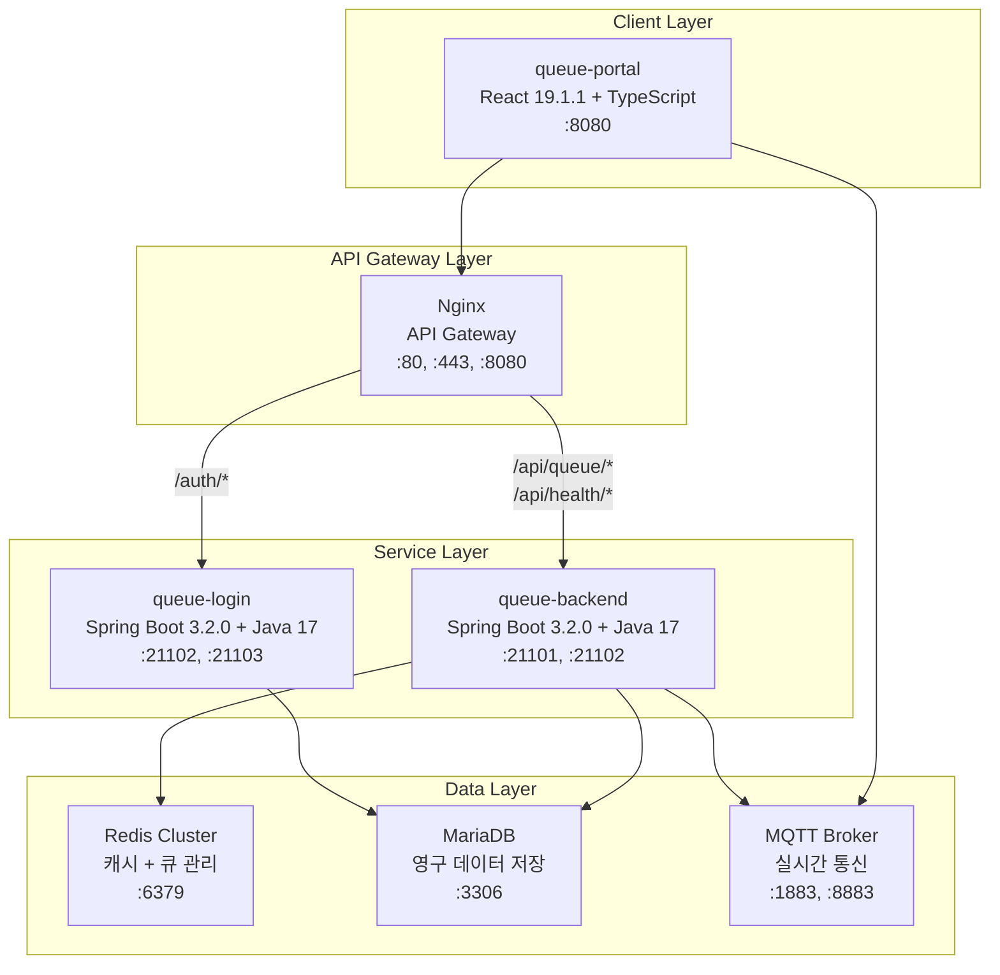

# 시스템 아키텍처 문서

## 개요
큐 시스템의 전체 아키텍처와 구성 요소, 데이터 흐름을 정의합니다.

## 프로젝트 구조

### 마이크로서비스 구성 (별도 Git 저장소)
```
queue/                     # 메인 프로젝트 (문서 및 설정)
├── docs/                  # 프로젝트 문서
└── README.md              # 프로젝트 개요

queue-portal/              # React + TypeScript + Vite 프론트엔드
├── src/                   # React 소스 코드
├── package.json           # Node.js 의존성
└── Dockerfile             # 컨테이너 이미지

queue-login/               # Spring Boot 인증 서비스
├── src/                   # Java 소스 코드
├── pom.xml                # Maven 의존성
└── Dockerfile             # 컨테이너 이미지

queue-backend/             # Spring Boot 큐 관리 서비스
├── src/                   # Java 소스 코드
├── pom.xml                # Maven 의존성
└── Dockerfile             # 컨테이너 이미지

queue-infra/               # Kubernetes 인프라 설정
├── backend/               # queue-backend Helm Chart
├── login/                 # queue-login Helm Chart
├── portal/                # queue-portal Helm Chart
├── nginx/                 # Nginx Helm Chart
├── mariadb/               # MariaDB Helm Chart
└── redis-cluster/         # Redis Cluster Helm Chart
```

## 전체 시스템 구성

### 아키텍처 다이어그램


## 구성 요소 상세

### 1. queue-portal (프론트엔드)
- **기술 스택**: React 19.1.1 + TypeScript + Vite
- **포트**: 8080
- **역할**: 사용자 인터페이스 제공
- **주요 기능**:
  - 로그인/회원가입 UI
  - 큐 대기 상태 표시
  - 실시간 MQTT 연결
  - JWT 토큰 관리

### 2. queue-login (인증 서비스)
- **기술 스택**: Spring Boot 3.2.0 + Java 17
- **포트**: 21102, 21103
- **역할**: 사용자 인증 및 권한 관리
- **주요 기능**:
  - 사용자 회원가입/로그인
  - JWT 토큰 생성 및 발급
  - 사용자 권한 관리
  - MariaDB 사용자 정보 조회
  - queue-backend를 통한 큐 상태 관리

#### 환경 변수
```yaml
# 서버 설정
SERVER_PORT: 21102
SERVER_SERVLET_CONTEXT_PATH: /api

# 데이터베이스 설정
DB_HOST: mariadb
DB_PORT: 3306
DB_NAME: queue_login
DB_USER: queue-user
DB_PASSWORD: mariadb-password-123

# JWT 설정
JWT_SECRET: queue-login-secret-key-2024
JWT_EXPIRATION: 900000
JWT_REFRESH_EXPIRATION: 604800000

# Queue Backend 연동
QUEUE_BACKEND_URL: http://queue-backend:21101

# 로깅 설정
LOGGING_LEVEL_COM_QUEUE_LOGIN: INFO
LOGGING_LEVEL_ROOT: WARN
```

### 3. queue-backend (큐 관리 서비스)
- **기술 스택**: Spring Boot 3.2.0 + Java 17
- **포트**: 21101, 21102
- **역할**: 큐 관리 및 실시간 통신
- **주요 기능**:
  - Redis 큐 상태 관리
  - MQTT 메시지 발행
  - 큐 상태 실시간 업데이트
  - 큐 통계 및 모니터링
  - 멀티 POD MQTT 이벤트 브로드캐스팅
  - JWT 토큰 저장 및 관리
  - 큐 완료 처리

#### 환경 변수
```yaml
# 서버 설정
SERVER_PORT: 21101

# Redis 설정
REDIS_HOST: redis
REDIS_PORT: 6379
REDIS_PASSWORD: ""
REDIS_DATABASE: 0

# JWT 설정
JWT_SECRET: queue-portal-production-secret-key-2024-redis-cluster
JWT_EXPIRATION: 86400000
JWT_REFRESH_EXPIRATION: 604800000

# 큐 시스템 설정
QUEUE_MAX_CAPACITY: 500000
QUEUE_PROCESSING_RATE: 1000
QUEUE_TYPES: login,game,portal
QUEUE_MONITORING_ENABLED: true
QUEUE_MONITORING_INTERVAL: 3000

# MQTT 설정
MQTT_BROKER_URL: tcp://mqtt:1883
MQTT_CLIENT_ID: queue-backend
MQTT_USERNAME: queue-user
MQTT_PASSWORD: queue-pass

# 로깅 설정
LOGGING_LEVEL_COM_QUEUEPORTAL: INFO
LOGGING_LEVEL_ROOT: WARN
```

### 4. Nginx (API Gateway)
- **포트**: 80 (HTTP), 443 (HTTPS), 8080 (Direct Access)
- **역할**: 요청 라우팅 및 로드 밸런싱
- **주요 기능**:
  - API 요청 라우팅 (3개 포트 지원)
  - SSL/TLS 종료 (포트 443)
  - 정적 파일 서빙 (프론트엔드)
  - CORS 처리
  - 다중 포트 지원 (80, 443, 8080)

#### API 라우팅 규칙

**포트 80 (HTTP)**
```nginx
server {
    listen 80;
    server_name _;
    
    # 인증 관련 API → queue-login (포트 21102)
    location /auth/ {
        proxy_pass http://queue-login:21102;
        proxy_set_header Host $host;
        proxy_set_header X-Real-IP $remote_addr;
        proxy_set_header X-Forwarded-For $proxy_add_x_forwarded_for;
    }
    
    # 큐 관련 API → queue-backend (포트 21101)
    location /api/queue/ {
        proxy_pass http://queue-backend:21101;
        proxy_set_header Host $host;
        proxy_set_header X-Real-IP $remote_addr;
        proxy_set_header X-Forwarded-For $proxy_add_x_forwarded_for;
    }
    
    # 헬스 체크 API → queue-backend (포트 21101)
    location /api/health/ {
        proxy_pass http://queue-backend:21101;
        proxy_set_header Host $host;
        proxy_set_header X-Real-IP $remote_addr;
        proxy_set_header X-Forwarded-For $proxy_add_x_forwarded_for;
    }
    
    # 정적 파일 → queue-portal (포트 8080)
    location / {
        proxy_pass http://queue-portal:8080;
        proxy_set_header Host $host;
        proxy_set_header X-Real-IP $remote_addr;
        proxy_set_header X-Forwarded-For $proxy_add_x_forwarded_for;
    }
}
```

**포트 443 (HTTPS)**
```nginx
server {
    listen 443 ssl;
    server_name _;
    
    # SSL 인증서 설정
    ssl_certificate /etc/ssl/certs/nginx.crt;
    ssl_certificate_key /etc/ssl/private/nginx.key;
    
    # 인증 관련 API → queue-login (포트 21102)
    location /auth/ {
        proxy_pass http://queue-login:21102;
        proxy_set_header Host $host;
        proxy_set_header X-Real-IP $remote_addr;
        proxy_set_header X-Forwarded-For $proxy_add_x_forwarded_for;
        proxy_set_header X-Forwarded-Proto $scheme;
    }
    
    # 큐 관련 API → queue-backend (포트 21101)
    location /api/queue/ {
        proxy_pass http://queue-backend:21101;
        proxy_set_header Host $host;
        proxy_set_header X-Real-IP $remote_addr;
        proxy_set_header X-Forwarded-For $proxy_add_x_forwarded_for;
        proxy_set_header X-Forwarded-Proto $scheme;
    }
    
    # 헬스 체크 API → queue-backend (포트 21101)
    location /api/health/ {
        proxy_pass http://queue-backend:21101;
        proxy_set_header Host $host;
        proxy_set_header X-Real-IP $remote_addr;
        proxy_set_header X-Forwarded-For $proxy_add_x_forwarded_for;
        proxy_set_header X-Forwarded-Proto $scheme;
    }
    
    # 정적 파일 → queue-portal (포트 8080)
    location / {
        proxy_pass http://queue-portal:8080;
        proxy_set_header Host $host;
        proxy_set_header X-Real-IP $remote_addr;
        proxy_set_header X-Forwarded-For $proxy_add_x_forwarded_for;
        proxy_set_header X-Forwarded-Proto $scheme;
    }
}
```

**포트 8080 (Direct Access)**
```nginx
server {
    listen 8080;
    server_name _;
    
    # 인증 관련 API → queue-login (포트 21102)
    location /auth/ {
        proxy_pass http://queue-login:21102;
        proxy_set_header Host $host;
        proxy_set_header X-Real-IP $remote_addr;
        proxy_set_header X-Forwarded-For $proxy_add_x_forwarded_for;
    }
    
    # 큐 관련 API → queue-backend (포트 21101)
    location /api/queue/ {
        proxy_pass http://queue-backend:21101;
        proxy_set_header Host $host;
        proxy_set_header X-Real-IP $remote_addr;
        proxy_set_header X-Forwarded-For $proxy_add_x_forwarded_for;
    }
    
    # 헬스 체크 API → queue-backend (포트 21101)
    location /api/health/ {
        proxy_pass http://queue-backend:21101;
        proxy_set_header Host $host;
        proxy_set_header X-Real-IP $remote_addr;
        proxy_set_header X-Forwarded-For $proxy_add_x_forwarded_for;
    }
    
    # 정적 파일 → queue-portal (포트 8080)
    location / {
        proxy_pass http://queue-portal:8080;
        proxy_set_header Host $host;
        proxy_set_header X-Real-IP $remote_addr;
        proxy_set_header X-Forwarded-For $proxy_add_x_forwarded_for;
    }
}
```

#### API 엔드포인트 분류

**queue-login (포트 21102, 21103)**
- `POST /auth/check-duplicates` - 중복 체크
- `POST /auth/register` - 회원가입
- `POST /auth/login` - 로그인
- `GET /auth/user/{userId}` - 사용자 정보 조회
- `POST /auth/refresh` - 토큰 갱신
- `POST /auth/logout` - 로그아웃
- `POST /auth/finalize` - 최종 토큰 발급
- `POST /auth/check-session` - 기존 세션 체크
- `GET /health` - 헬스 체크

**queue-backend (포트 21101, 21102)**
- `POST /api/queue/join` - 큐 입장
- `POST /api/queue/leave` - 큐 퇴장
- `GET /api/queue/position` - 큐 위치 조회
- `GET /api/queue/status` - 큐 상태 조회
- `GET /api/queue/status/all` - 모든 큐 상태 조회
- `POST /api/queue/process` - 큐 처리 (관리자)
- `GET /api/queue/{queueType}/stats` - 큐 통계 조회
- `POST /api/queue/finalize` - 최종 로그인 완료
- `GET /api/health` - 기본 헬스 체크
- `GET /api/health/redis` - Redis 연결 상태
- `GET /api/health/detailed` - 상세 시스템 상태

### 5. Redis Cluster (캐시 레이어)
- **포트**: 6379
- **역할**: 캐시 및 실시간 데이터 저장
- **주요 용도**:
  - 큐 상태 저장 (Sorted Set)
  - JWT 토큰 저장 (queue-backend)
  - 실시간 큐 통계
  - MQTT 클라이언트 관리
  - 큐 설정 및 모니터링

#### 환경 변수
```yaml
# Redis 설정
REDIS_HOST: redis
REDIS_PORT: 6379
REDIS_PASSWORD: ""
REDIS_DATABASE: 0
REDIS_MAX_ACTIVE: 20
REDIS_MAX_IDLE: 10
REDIS_MIN_IDLE: 5
REDIS_MAX_WAIT: 3000
```

### 6. MQTT Broker (실시간 통신)
- **포트**: 1883 (비보호), 8883 (보호)
- **역할**: 실시간 메시지 브로커
- **주요 용도**:
  - 큐 상태 실시간 전송
  - 대기 완료 알림
  - 큐 취소 알림
  - 멀티 클라이언트 메시지 전송

#### 환경 변수
```yaml
# MQTT 설정
MQTT_BROKER_URL: tcp://mqtt:1883
MQTT_BROKER_URL_SECURE: tcp://mqtt:8883
MQTT_CLIENT_ID: queue-backend
MQTT_USERNAME: queue-user
MQTT_PASSWORD: queue-pass
MQTT_TOPIC_QUEUE_UPDATE: queue/{ticketId}/status
MQTT_TOPIC_QUEUE_READY: queue/{ticketId}/ready
MQTT_TOPIC_QUEUE_CANCELLED: queue/{ticketId}/cancelled
MQTT_TOPIC_KEEPALIVE: queue/{ticketId}/keepalive
```

### 7. MariaDB (데이터베이스)
- **포트**: 3306
- **역할**: 영구 데이터 저장소
- **주요 용도**:
  - 사용자 정보 저장 (queue-login)
  - 사용자 세션 관리 (queue-login)
  - 로그 데이터 저장 (queue-backend)
  - 시스템 설정 저장 (queue-backend)

#### 환경 변수
```yaml
# MariaDB 설정
DB_HOST: mariadb
DB_PORT: 3306
DB_NAME: queue_login
DB_USER: queue-user
DB_PASSWORD: mariadb-password-123
DB_DRIVER: org.mariadb.jdbc.Driver
DB_DIALECT: org.hibernate.dialect.MariaDBDialect

# JPA 설정
JPA_HIBERNATE_DDL_AUTO: validate
JPA_SHOW_SQL: false
JPA_PROPERTIES_HIBERNATE_FORMAT_SQL: true

# Flyway 설정
FLYWAY_ENABLED: true
FLYWAY_LOCATIONS: classpath:db/migration
FLYWAY_BASELINE_ON_MIGRATE: true
FLYWAY_VALIDATE_ON_MIGRATE: true
```

## 포트 요약

| 서비스 | 포트 | 프로토콜 | 용도 | 접근 방법 |
|--------|------|----------|------|-----------|
| **Nginx** | 80 | HTTP | 웹 서버 (비보호) | `http://domain.com` |
| **Nginx** | 443 | HTTPS | 웹 서버 (보호) | `https://domain.com` |
| **Nginx** | 8080 | HTTP | 직접 접근 | `http://domain.com:8080` |
| **queue-portal** | 8080 | HTTP | 프론트엔드 (내부) | Nginx를 통해서만 |
| **queue-login** | 21102 | HTTP | 인증 API (주) | Nginx를 통해서만 |
| **queue-login** | 21103 | HTTP | 인증 API (보조) | Nginx를 통해서만 |
| **queue-backend** | 21101 | HTTP | 큐 관리 API (주) | Nginx를 통해서만 |
| **queue-backend** | 21102 | HTTP | 큐 관리 API (보조) | Nginx를 통해서만 |
| **Redis** | 6379 | TCP | 캐시 및 큐 관리 | 내부 네트워크만 |
| **MariaDB** | 3306 | TCP | 데이터베이스 | 내부 네트워크만 |
| **MQTT** | 1883 | TCP | 실시간 통신 (비보호) | 내부 네트워크만 |
| **MQTT** | 8883 | TCP | 실시간 통신 (보호) | 내부 네트워크만 |

### 접근 방법별 설명

#### 1. 외부 접근 (클라이언트)
- **HTTP**: `http://domain.com` (포트 80)
- **HTTPS**: `https://domain.com` (포트 443)
- **Direct**: `http://domain.com:8080` (포트 8080)

#### 2. 내부 접근 (서비스 간)
- **queue-portal**: `http://queue-portal:8080`
- **queue-login**: `http://queue-login:21102`
- **queue-backend**: `http://queue-backend:21101`
- **Redis**: `redis://redis:6379`
- **MariaDB**: `jdbc:mysql://mariadb:3306`
- **MQTT**: `mqtt://mqtt:1883` 또는 `mqtts://mqtt:8883`

## 환경 변수 요약

### 공통 환경 변수
```yaml
# JWT 설정 (모든 서비스 공통)
JWT_SECRET: queue-portal-production-secret-key-2024-redis-cluster
JWT_EXPIRATION: 86400000
JWT_REFRESH_EXPIRATION: 604800000

# Redis 설정 (queue-backend)
REDIS_HOST: redis
REDIS_PORT: 6379
REDIS_PASSWORD: ""

# MariaDB 설정 (queue-login)
DB_HOST: mariadb
DB_PORT: 3306
DB_NAME: queue_login
DB_USER: queue-user
DB_PASSWORD: mariadb-password-123

# MQTT 설정 (queue-backend)
MQTT_BROKER_URL: tcp://mqtt:1883
MQTT_USERNAME: queue-user
MQTT_PASSWORD: queue-pass
```

### 서비스별 환경 변수

#### queue-login
```yaml
SERVER_PORT: 21102
SERVER_SERVLET_CONTEXT_PATH: /api
QUEUE_BACKEND_URL: http://queue-backend:21101
```

#### queue-backend
```yaml
SERVER_PORT: 21101
QUEUE_MAX_CAPACITY: 500000
QUEUE_PROCESSING_RATE: 1000
QUEUE_TYPES: login,game,portal
MQTT_CLIENT_ID: queue-backend
```

#### queue-portal
```yaml
VITE_API_BASE_URL: http://nginx:80
VITE_MQTT_BROKER_URL: ws://mqtt:9001
```

### Kubernetes ConfigMap 예시
```yaml
apiVersion: v1
kind: ConfigMap
metadata:
  name: queue-system-config
data:
  # Redis 설정
  REDIS_HOST: "redis"
  REDIS_PORT: "6379"
  REDIS_PASSWORD: ""
  
  # MariaDB 설정
  DB_HOST: "mariadb"
  DB_PORT: "3306"
  DB_NAME: "queue_login"
  DB_USER: "queue-user"
  
  # MQTT 설정
  MQTT_BROKER_URL: "tcp://mqtt:1883"
  MQTT_USERNAME: "queue-user"
  
  # JWT 설정
  JWT_SECRET: "queue-portal-production-secret-key-2024-redis-cluster"
  JWT_EXPIRATION: "86400000"
  JWT_REFRESH_EXPIRATION: "604800000"
  
  # 큐 시스템 설정
  QUEUE_MAX_CAPACITY: "500000"
  QUEUE_PROCESSING_RATE: "1000"
  QUEUE_TYPES: "login,game,portal"
```

### Kubernetes Secret 예시
```yaml
apiVersion: v1
kind: Secret
metadata:
  name: queue-system-secrets
type: Opaque
data:
  # Base64 인코딩된 값들
  DB_PASSWORD: bWFyaWFkYi1wYXNzd29yZC0xMjM=  # mariadb-password-123
  REDIS_PASSWORD: ""  # 빈 값
  MQTT_PASSWORD: cXVldWUtcGFzcw==  # queue-pass
  JWT_SECRET: cXVldWUtcG9ydGFsLXByb2R1Y3Rpb24tc2VjcmV0LWtleS0yMDI0LXJlZGlzLWNsdXN0ZXI=  # queue-portal-production-secret-key-2024-redis-cluster
```
