# 📊 Queue System 사용 사례 및 데이터 플로우

## 📋 목차

### 1. 인증 및 사용자 관리

#### Phase 1: 기본 인증 시스템 (현재)
- [1.1 사용자 회원가입](#11-사용자-회원가입)
- [1.2 사용자 로그인](#12-사용자-로그인)
- [1.3 토큰 갱신](#13-토큰-갱신)
- [1.4 사용자 로그아웃](#14-사용자-로그아웃)


### 2. 로그인 큐 시스템 (대용량 트래픽 대응)
- [2.1 로그인 요청 및 검증](#21-로그인-요청-및-검증)
- [2.2 대기열 티켓 발급](#22-대기열-티켓-발급)
- [2.3 대기열 상태 관리](#23-대기열-상태-관리)
- [2.4 SSE 실시간 통신](#24-sse-실시간-통신)
- [2.5 토큰 발급 및 완료](#25-토큰-발급-및-완료)
- [2.6 다중 접속 처리](#26-다중-접속-처리)

### 3. 게임 큐 시스템
- [3.1 게임 매칭 요청](#31-게임-매칭-요청)
- [3.2 게임 매칭 상태 조회](#32-게임-매칭-상태-조회)
- [3.3 게임 매칭 완료](#33-게임-매칭-완료)
- [3.4 게임 매칭 취소](#34-게임-매칭-취소)

### 4. 랭킹 큐 시스템
- [4.1 점수 제출](#41-점수-제출)
- [4.2 랭킹 조회](#42-랭킹-조회)
- [4.3 친구 랭킹 조회](#43-친구-랭킹-조회)
- [4.4 랭킹 업데이트 알림](#44-랭킹-업데이트-알림)

### 5. 포털 큐 시스템
- [5.1 파일 업로드 요청](#51-파일-업로드-요청)
- [5.2 데이터 처리 요청](#52-데이터-처리-요청)
- [5.3 알림 발송 요청](#53-알림-발송-요청)
- [5.4 작업 상태 조회](#54-작업-상태-조회)

### 6. 통합 큐 관리
- [6.1 큐 간 연동](#61-큐-간-연동)
- [6.2 우선순위 관리](#62-우선순위-관리)
- [6.3 부하 분산](#63-부하-분산)
- [6.4 모니터링 및 알림](#64-모니터링-및-알림)

---

## 1. 인증 및 사용자 관리

### Phase 1: 기본 인증 시스템 (현재)

### 1.1 사용자 회원가입

#### 데이터 흐름
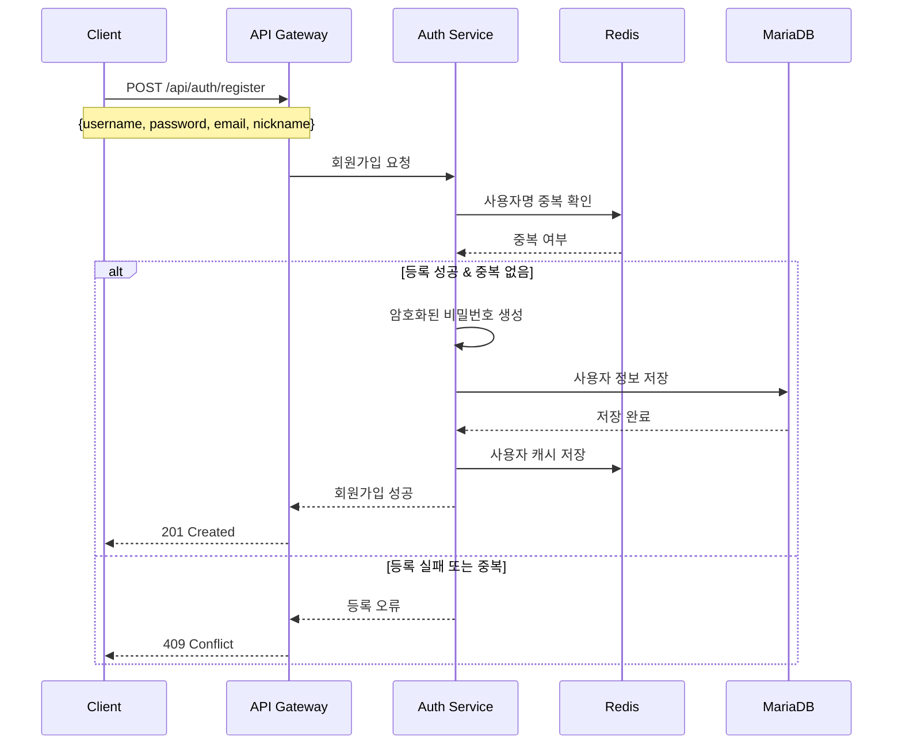

#### Redis 데이터 구조
```redis
# 사용자 정보 캐시
HSET user:user123 username "user123"
HSET user:user123 email "user@example.com"
HSET user:user123 nickname "닉네임"
HSET user:user123 role "NORMAL"
HSET user:user123 status "ACTIVE"
HSET user:user123 created_at "2024-12-18T10:00:00Z"

# 사용자명 인덱스
SADD usernames "user123"

# 이메일 인덱스
SADD emails "user@example.com"
```

### 1.2 사용자 로그인

#### 데이터 흐름
```mermaid
sequenceDiagram
    participant C as Client
    participant API as API Gateway
    participant Auth as Auth Service
    participant Redis as Redis
    participant DB as MariaDB
    
    C->>API: POST /api/auth/login
    Note over C,API: {username, password}
    
    API->>Auth:  로그인 요청
    Auth->>:  인증 요청
->>:  정책 검증
-->>Auth:  인증 결과
    Auth->>Redis:  사용자 정보 조회
    
    alt  캐시에 있음
        Redis-->>Auth:  사용자 정보
    else  캐시에 없음
        Auth->>DB:  사용자 정보 조회
        DB-->>Auth:  사용자 정보
        Auth->>Redis:  사용자 정보 캐시 저장
    end
    
    Auth->>:  비밀번호 검증
-->>Auth:  인증 성공
    
    alt  인증 성공
        Auth->>:  JWT 토큰 생성 요청
-->>Auth:  Access Token, Refresh Token
        Auth->>Redis:  Refresh Token 저장
        Auth-->>API:  토큰 반환
        API-->>C: 200 OK + {accessToken, refreshToken}
    else  인증 실패
        Auth-->>API:  인증 실패
        API-->>C: 401 Unauthorized
    end
```

#### Redis 데이터 구조
```redis
#  JWT 토큰 저장
HSET refresh_tokens:user123 token "eyJhbGciOiJIUzI1NiIsInR5cCI6IkpXVCJ9..."
HSET refresh_tokens:user123 expires_at "2024-12-25T10:00:00Z"
HSET refresh_tokens:user123 role "VIP_Users,Premium_Users"
HSET refresh_tokens:user123 permissions "queue_priority,game_early_access"

#  사용자 세션
HSET session:user123 last_login "2024-12-18T10:00:00Z"
HSET session:user123 login_count 1
HSET session:user123 role "VIP_Users,Premium_Users"
HSET session:user123 permissions "queue_priority,game_early_access"
HSET session:user123 risk_score 0.2
```

### 1.3 토큰 갱신

#### 데이터 흐름
```mermaid
sequenceDiagram
    participant C as Client
    participant API as API Gateway
    participant Auth as Auth Service
    participant Redis as Redis
    
    C->>API: POST /api/auth/refresh
    Note over C,API: {refreshToken}
    
    API->>Auth:  토큰 갱신 요청
    Auth->>:  세션 검증
-->>Auth:  세션 유효성
    Auth->>Redis:  Refresh Token 검증
    Redis-->>Auth: 토큰 유효성
    
    alt  토큰 유효
        Auth->>: 새  Access Token 요청
-->>Auth: 새  Access Token
        Auth->>Redis: 새  Refresh Token 저장
        Auth-->>API: 새  토큰 반환
        API-->>C: 200 OK + {accessToken, refreshToken}
    else  토큰 무효
        Auth-->>API:  토큰 무효
        API-->>C: 401 Unauthorized
    end
```

### 1.4 사용자 로그아웃

#### 데이터 흐름
```mermaid
sequenceDiagram
    participant C as Client
    participant API as API Gateway
    participant Auth as Auth Service
    participant Redis as Redis
    
    C->>API: POST /api/auth/logout
    Note over C,API: {refreshToken}
    
    API->>Auth:  로그아웃 요청
    Auth->>:  세션 무효화
-->>Auth:  세션 무효화 완료
    Auth->>Redis:  Refresh Token 삭제
    Redis-->>Auth: 삭제 완료
    Auth-->>API:  로그아웃 완료
    API-->>C: 200 OK
```


#### 데이터 흐름
```mermaid
sequenceDiagram
    participant C as Client
    participant API as API Gateway
    participant Auth as Auth Service
    participant Redis as Redis
    participant DB as MariaDB
    
    C->>API: POST /api/auth/login
    Note over C,API: {username, password}
    
    API->>Auth:  로그인 요청
    Auth->>:  인증 요청
->>:  정책 검증
-->>Auth:  인증 결과
    Auth->>Redis:  사용자 정보 조회
    
    alt  캐시에 있음
        Redis-->>Auth:  사용자 정보
    else  캐시에 없음
        Auth->>DB:  사용자 정보 조회
        DB-->>Auth:  사용자 정보
        Auth->>Redis:  사용자 정보 캐시 저장
    end
    
    Auth->>:  비밀번호 검증
-->>Auth:  인증 성공
    
    alt  인증 성공
        Auth->>:  JWT 토큰 생성 요청
-->>Auth:  Access Token, Refresh Token
        Auth->>Redis:  Refresh Token 저장
        Auth-->>API:  토큰 반환
        API-->>C: 200 OK + {accessToken, refreshToken}
    else  인증 실패
        Auth-->>API:  인증 실패
        API-->>C: 401 Unauthorized
    end
```

#### Redis 데이터 구조
```redis
#  JWT 토큰 저장
HSET refresh_tokens:user123 token "eyJhbGciOiJIUzI1NiIsInR5cCI6IkpXVCJ9..."
HSET refresh_tokens:user123 expires_at "2024-12-25T10:00:00Z"
HSET refresh_tokens:user123 role "VIP_Users,Premium_Users"
HSET refresh_tokens:user123 permissions "queue_priority,game_early_access"

#  사용자 세션
HSET session:user123 last_login "2024-12-18T10:00:00Z"
HSET session:user123 login_count 1
HSET session:user123 role "VIP_Users,Premium_Users"
HSET session:user123 permissions "queue_priority,game_early_access"
HSET session:user123 risk_score 0.2
```

### 1.7  토큰 갱신

#### 데이터 흐름
```mermaid
sequenceDiagram
    participant C as Client
    participant API as API Gateway
    participant Auth as Auth Service
    participant Redis as Redis
    
    C->>API: POST /api/auth/refresh
    Note over C,API: {refreshToken}
    
    API->>Auth:  토큰 갱신 요청
    Auth->>:  세션 검증
-->>Auth:  세션 유효성
    Auth->>Redis:  Refresh Token 검증
    Redis-->>Auth: 토큰 유효성
    
    alt  토큰 유효
        Auth->>: 새  Access Token 요청
-->>Auth: 새  Access Token
        Auth->>Redis: 새  Refresh Token 저장
        Auth-->>API: 새  토큰 반환
        API-->>C: 200 OK + {accessToken, refreshToken}
    else  토큰 무효
        Auth-->>API:  토큰 무효
        API-->>C: 401 Unauthorized
    end
```

### 1.8  기반 사용자 로그아웃

#### 데이터 흐름
```mermaid
sequenceDiagram
    participant C as Client
    participant API as API Gateway
    participant Auth as Auth Service
    participant Redis as Redis
    
    C->>API: POST /api/auth/logout
    Note over C,API: {refreshToken}
    
    API->>Auth:  로그아웃 요청
    Auth->>:  세션 무효화
-->>Auth:  세션 무효화 완료
    Auth->>Redis:  Refresh Token 삭제
    Redis-->>Auth: 삭제 완료
    Auth-->>API:  로그아웃 완료
    API-->>C: 200 OK
```

### 1.9  그룹 관리

#### 데이터 흐름
```mermaid
sequenceDiagram
    participant C as Client
    participant API as API Gateway
    participant Auth as Auth Service
    participant Redis as Redis
    
    C->>API: GET /api//groups
    Note over C,API: Authorization: Bearer {token}
    
    API->>Auth:  그룹 조회 요청
    Auth->>: 사용자  그룹 조회
-->>Auth:  그룹 정보
    Auth->>Redis:  그룹 정보 캐시
    Redis-->>Auth: 캐시 완료
    Auth-->>API:  그룹 목록
    API-->>C: 200 OK + {groups}
```

#### Redis 데이터 구조
```redis
#  그룹 정보
HSET :groups:group123 groupName "VIP Users"
HSET :groups:group123 description "VIP 사용자 그룹"
HSET :groups:group123 memberCount 150
HSET :groups:group123 permissions "queue_priority,game_early_access"

# 사용자  그룹 매핑
SADD :user:user123:groups "group123"
SADD :user:user123:groups "group456"
```

### 1.6  정책 관리

#### 데이터 흐름
```mermaid
sequenceDiagram
    participant C as Client
    participant API as API Gateway
    participant Auth as Auth Service
    participant Redis as Redis
    
    C->>API: GET /api//policies
    Note over C,API: Authorization: Bearer {token}
    
    API->>Auth:  정책 조회 요청
    Auth->>:  정책 조회
-->>Auth:  정책 정보
    Auth->>Redis:  정책 캐시
    Redis-->>Auth: 캐시 완료
    Auth-->>API:  정책 목록
    API-->>C: 200 OK + {policies}
```

#### Redis 데이터 구조
```redis
#  정책 정보
HSET :policies:policy123 policyName "Queue Access Policy"
HSET :policies:policy123 description "큐 접근 정책"
HSET :policies:policy123 rules '[{"action":"queue:join","resource":"queue:login","condition":"user.role == \"VIP\""}]'

#  정책 캐시
SET :policy:cache:last_update "2024-01-01T00:00:00Z"
```

### 1.7  권한 검증

#### 데이터 흐름
```mermaid
sequenceDiagram
    participant C as Client
    participant API as API Gateway
    participant Auth as Auth Service
    participant Redis as Redis
    
    C->>API: POST /api//check-permission
    Note over C,API: {action, resource, context}
    
    API->>Auth:  권한 검증 요청
    Auth->>: 사용자 권한 검증
->>: 정책 엔진 실행
-->>Auth: 권한 검증 결과
    Auth->>Redis: 검증 결과 캐시
    Redis-->>Auth: 캐시 완료
    Auth-->>API: 권한 검증 결과
    API-->>C: 200 OK + {allowed, reason, policyMatched}
```

#### Redis 데이터 구조
```redis
#  권한 검증 캐시
HSET :permission:cache:user123:queue:join:queue:login allowed true
HSET :permission:cache:user123:queue:join:queue:login reason "User has VIP role with queue priority access"
HSET :permission:cache:user123:queue:join:queue:login policyMatched "policy123"
HSET :permission:cache:user123:queue:join:queue:login expiresAt "2024-01-01T01:00:00Z"

#  감사 로그
LPUSH :audit:logs "2024-01-01T00:00:00Z|user123|queue:join|queue:login|ALLOWED|policy123"
```

---

## 2. 로그인 큐 시스템 (대용량 트래픽 대응)

### 2.1 로그인 요청 및 검증

#### 데이터 흐름
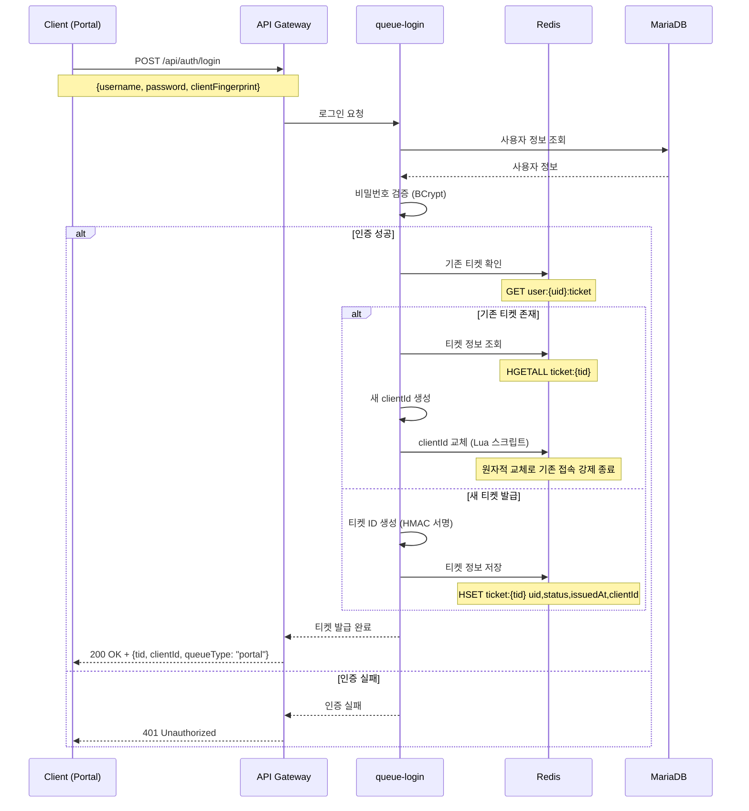

#### Redis 데이터 구조
```redis
# 사용자별 티켓 관리
SET user:{uid}:ticket "tid_abc123" EX 900  # 15분 TTL

# 티켓 상세 정보
HSET ticket:{tid} uid "user123"
HSET ticket:{tid} status "PENDING"
HSET ticket:{tid} issuedAt "1703123456789"
HSET ticket:{tid} lastSeen "1703123456789"
HSET ticket:{tid} clientId "client_xyz789"
HSET ticket:{tid} position 0

# 포털 로그인 큐 (Sorted Set)
ZADD queue:portal 1703123456789 "tid_abc123"

# SSE 클라이언트 관리
SADD sse:clients:{tid} "client_xyz789"
```

### 2.2 대기열 티켓 발급

#### 티켓 발급 로직
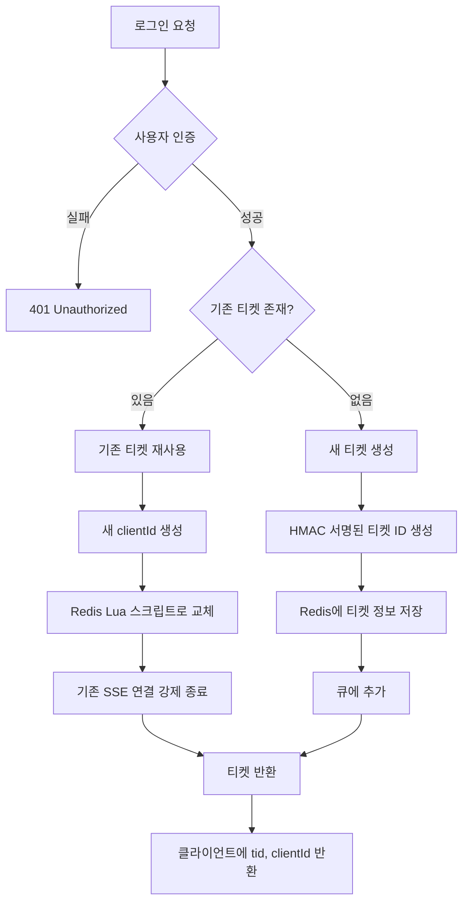

#### Redis Lua 스크립트 (clientId 교체)
```lua
-- KEYS[1] = ticket:{tid}
-- KEYS[2] = sse:clients:{tid}
-- ARGV[1] = newClientId
local oldClientId = redis.call('HGET', KEYS[1], 'clientId')
local status = redis.call('HGET', KEYS[1], 'status')
if status == 'CANCELLED' then 
    return {err="cancelled"} 
end
redis.call('HSET', KEYS[1], 'clientId', ARGV[1])
redis.call('HSET', KEYS[1], 'lastSeen', ARGV[2])
if oldClientId then 
    redis.call('SREM', KEYS[2], oldClientId) 
end
redis.call('SADD', KEYS[2], ARGV[1])
return oldClientId
```

### 2.3 대기열 상태 관리

#### Rate Limit 처리
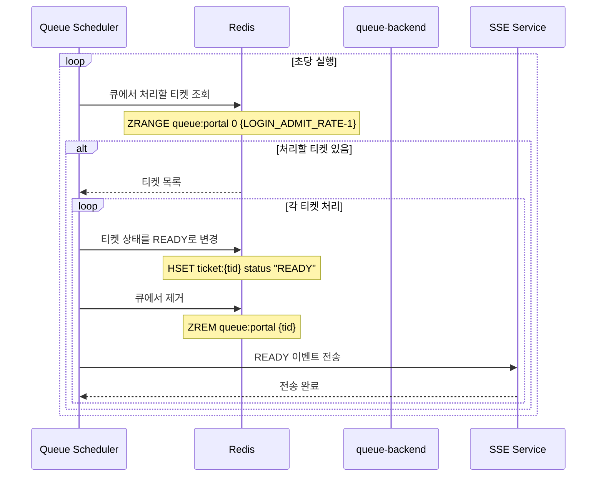

#### Redis 데이터 구조 (Rate Limit)
```redis
# 큐 처리 설정
HSET queue:config:portal admitRate 60  # 분당 60명
HSET queue:config:portal podCount 3    # Pod 3대
HSET queue:config:portal totalRate 180 # 총 분당 180명

# 큐 통계
HSET queue:stats:portal totalWaiting 1250
HSET queue:stats:portal processedToday 15420
HSET queue:stats:portal avgWaitTime 45
```

### 2.4 SSE 실시간 통신

#### SSE 연결 및 인증
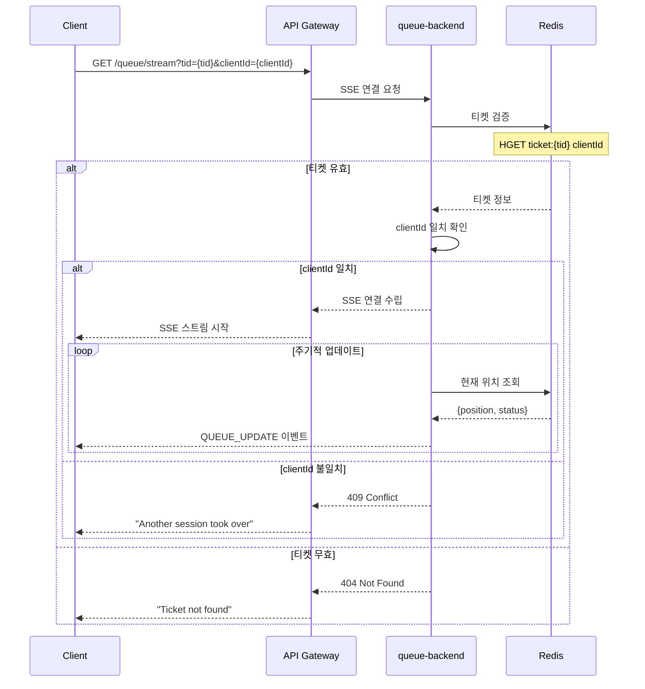

#### SSE 이벤트 타입
```javascript
// 큐 상태 업데이트
{
  "type": "QUEUE_UPDATE",
  "data": {
    "position": 123,
    "estimatedWaitSec": 45,
    "totalWaiting": 1250
  }
}

// 로그인 준비 완료
{
  "type": "QUEUE_READY",
  "data": {
    "finalizeDeadlineSec": 60,
    "tid": "tid_abc123"
  }
}

// 다른 세션으로 인한 연결 종료
{
  "type": "KICKED_OUT",
  "data": {
    "reason": "TAKEN_OVER",
    "message": "다른 곳에서 로그인되어 연결이 종료되었습니다."
  }
}

// Keep-alive
{
  "type": "KEEPALIVE",
  "data": {
    "serverTime": 1703123456789
  }
}
```

### 2.5 토큰 발급 및 완료

#### 최종 토큰 발급
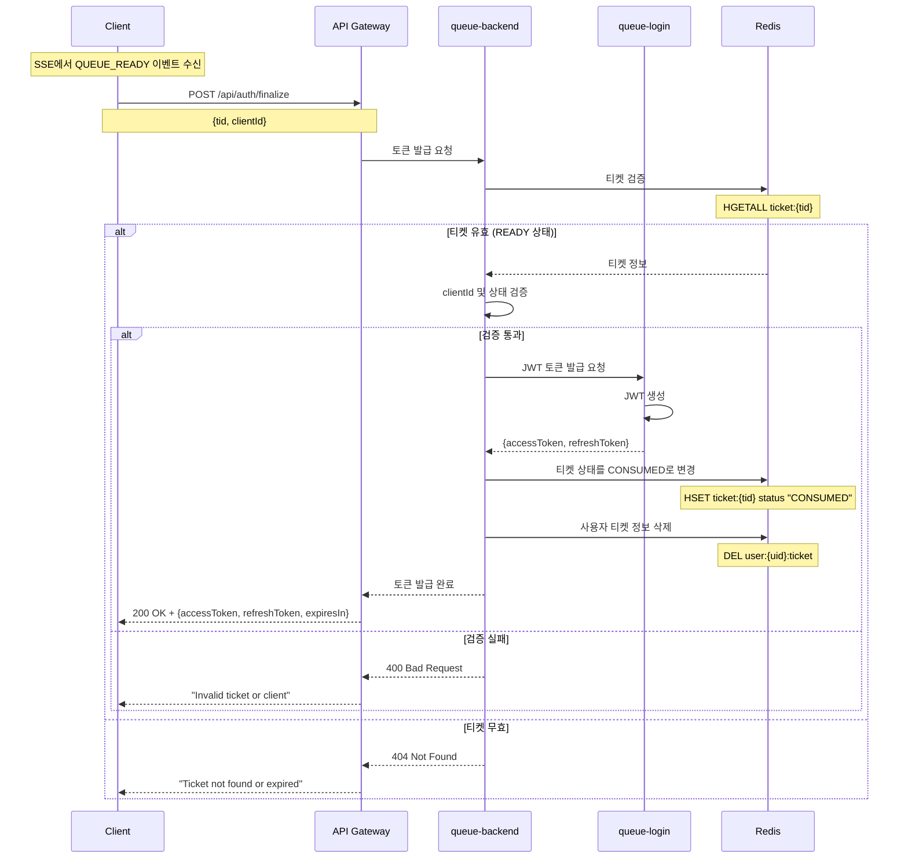

### 2.6 다중 접속 처리

#### 동일 계정 다중 접속 처리
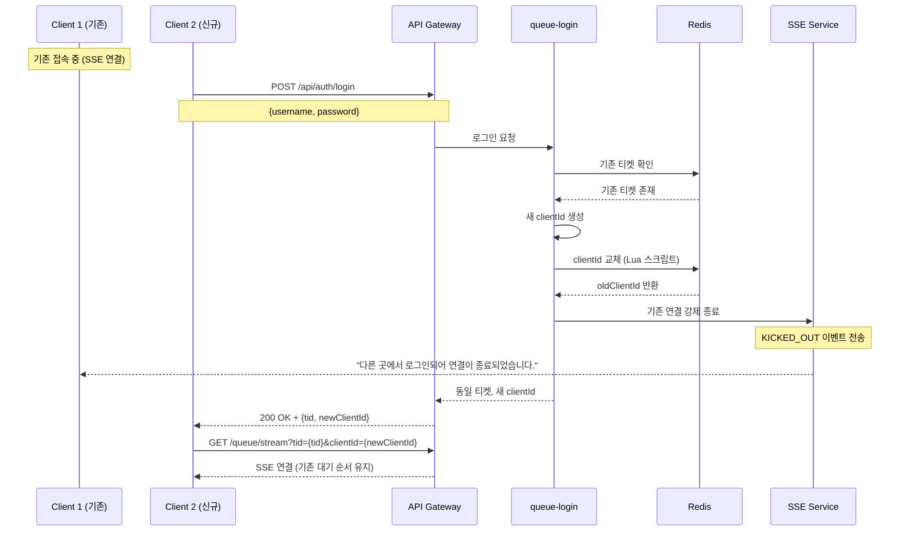

#### Redis 데이터 구조 (다중 접속)
```redis
# 사용자별 티켓 (1개만 유지)
SET user:user123:ticket "tid_abc123" EX 900

# 티켓 상세 정보 (clientId 교체됨)
HSET ticket:tid_abc123 uid "user123"
HSET ticket:tid_abc123 status "PENDING"
HSET ticket:tid_abc123 clientId "client_new456"  # 새 clientId
HSET ticket:tid_abc123 position 45

# SSE 클라이언트 (1개만 유지)
SADD sse:clients:tid_abc123 "client_new456"
SREM sse:clients:tid_abc123 "client_old789"  # 기존 제거
```

---

## 3. 게임 큐 시스템

### 3.1 게임 매칭 요청

#### 데이터 흐름
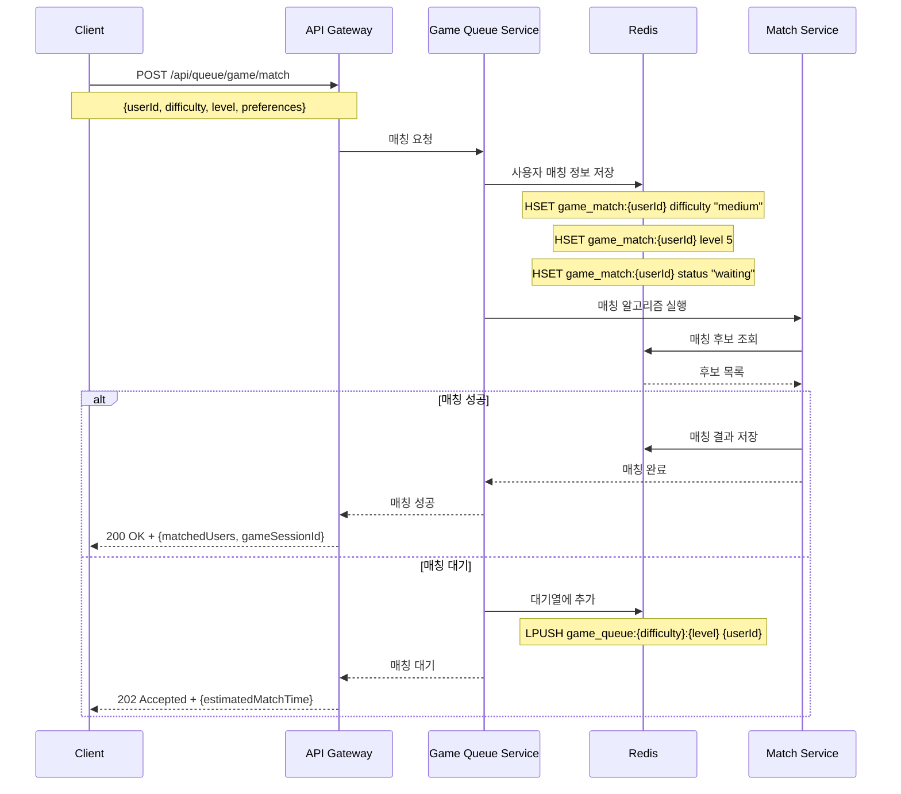

#### Redis 데이터 구조
```redis
# 난이도별 게임 큐
LPUSH game_queue:easy:1 "user123"
LPUSH game_queue:medium:5 "user456"
LPUSH game_queue:hard:10 "user789"

# 매칭 상태
HSET game_match:user123 status "waiting"
HSET game_match:user123 difficulty "medium"
HSET game_match:user123 level 5
HSET game_match:user123 created_at "1703123456789"
```

### 3.2 게임 매칭 상태 조회

#### 데이터 흐름
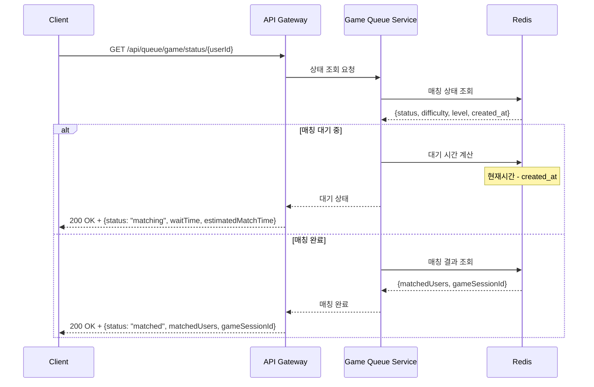

### 3.3 게임 매칭 완료

#### 데이터 흐름
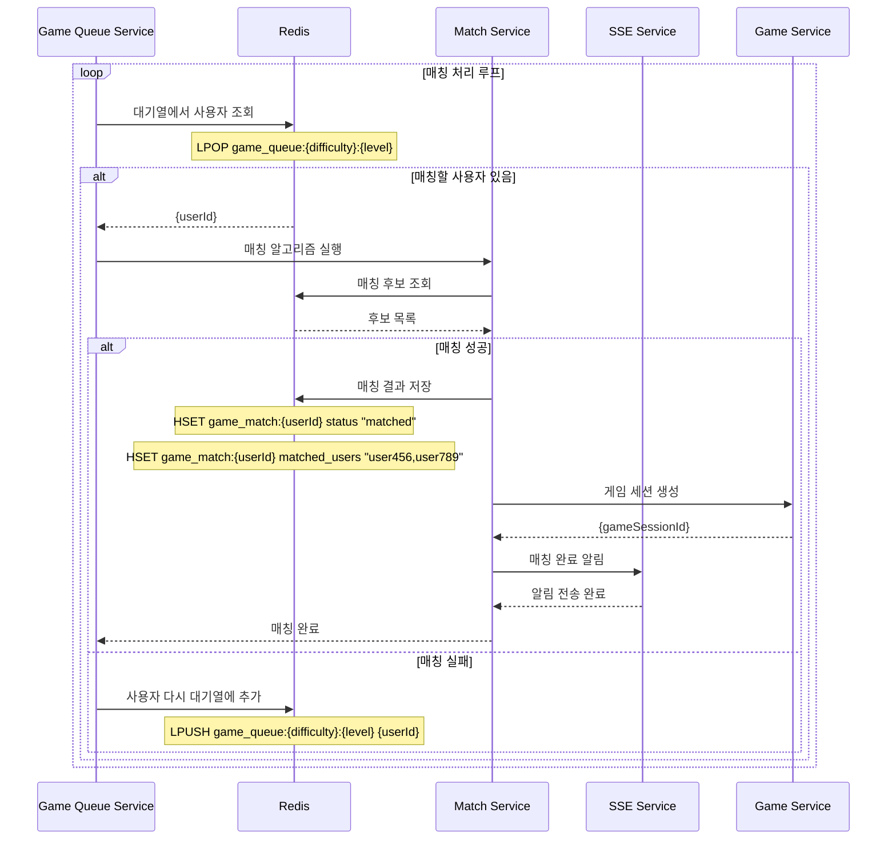

### 3.4 게임 매칭 취소

#### 데이터 흐름
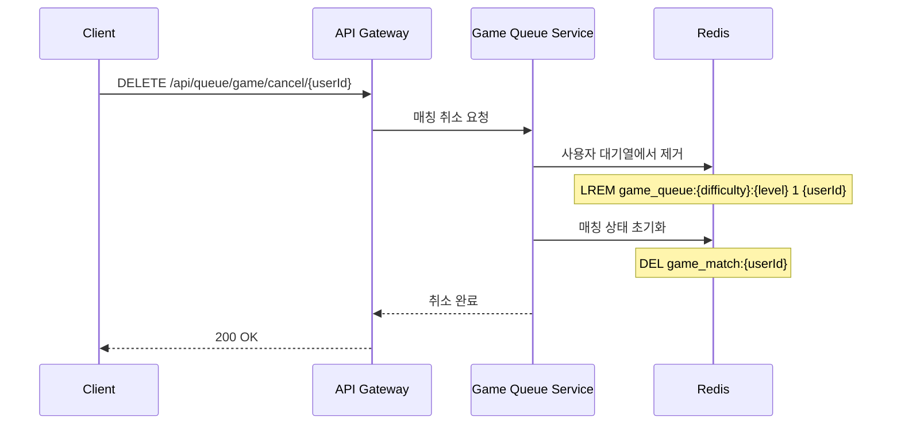

---

## 4. 랭킹 큐 시스템

### 4.1 점수 제출

#### 데이터 흐름
```mermaid
sequenceDiagram
    participant C as Client
    participant API as API Gateway
    participant RankingQ as Ranking Queue Service
    participant Redis as Redis
    participant Validator as Score Validator
    
    C->>API: POST /api/queue/ranking/submit
    Note over C,API: {userId, score, gameType, difficulty}
    
    API->>RankingQ: 점수 제출 요청
    RankingQ->>Validator: 점수 검증
    Validator-->>RankingQ: 검증 결과
    
    alt 점수 유효
        RankingQ->>Redis: 점수 큐에 추가
        Note over Redis: LPUSH ranking_queue:submit {scoreData}
        
        RankingQ->>Redis: 사용자 점수 임시 저장
        Note over Redis: HSET temp_score:{userId} score 15000
        Note over Redis: HSET temp_score:{userId} game_type "suika"
        Note over Redis: HSET temp_score:{userId} difficulty "medium"
        
        RankingQ-->>API: 점수 제출 완료
        API-->>C: 202 Accepted + {taskId}
    else 점수 무효
        RankingQ-->>API: 점수 무효
        API-->>C: 400 Bad Request + {error}
    end
```

#### Redis 데이터 구조
```redis
# 점수 제출 큐
LPUSH ranking_queue:submit '{"userId":"user123","score":15000,"gameType":"suika","difficulty":"medium","timestamp":1703123456789}'

# 임시 점수 저장
HSET temp_score:user123 score 15000
HSET temp_score:user123 game_type "suika"
HSET temp_score:user123 difficulty "medium"
HSET temp_score:user123 timestamp "1703123456789"
```

### 4.2 랭킹 조회

#### 데이터 흐름
```mermaid
sequenceDiagram
    participant C as Client
    participant API as API Gateway
    participant RankingQ as Ranking Queue Service
    participant Redis as Redis
    
    C->>API: GET /api/queue/ranking/{type}/{period}
    Note over C,API: type: total/daily/weekly, period: 20241218
    
    API->>RankingQ: 랭킹 조회 요청
    RankingQ->>Redis: 랭킹 데이터 조회
    
    alt 전체 랭킹
        Redis-->>RankingQ: ZREVRANGE ranking:total:all 0 99 WITHSCORES
    else 일일 랭킹
        Redis-->>RankingQ: ZREVRANGE ranking:daily:20241218 0 99 WITHSCORES
    else 주간 랭킹
        Redis-->>RankingQ: ZREVRANGE ranking:weekly:2024W51 0 99 WITHSCORES
    end
    
    RankingQ->>Redis: 사용자 개인 랭킹 조회
    Redis-->>RankingQ: ZRANK ranking:{type}:{period} {userId}
    
    RankingQ->>RankingQ: 랭킹 데이터 포맷팅
    RankingQ-->>API: 랭킹 정보
    API-->>C: 200 OK + {rankings, userRank, totalPlayers}
```

#### Redis 데이터 구조
```redis
# 전체 랭킹
ZADD ranking:total:all 20000 "user456"
ZADD ranking:total:all 18000 "user789"
ZADD ranking:total:all 15000 "user123"

# 일일 랭킹
ZADD ranking:daily:20241218 20000 "user456"
ZADD ranking:daily:20241218 18000 "user789"
ZADD ranking:daily:20241218 15000 "user123"

# 주간 랭킹
ZADD ranking:weekly:2024W51 20000 "user456"
ZADD ranking:weekly:2024W51 18000 "user789"
ZADD ranking:weekly:2024W51 15000 "user123"
```

### 4.3 친구 랭킹 조회

#### 데이터 흐름
```mermaid
sequenceDiagram
    participant C as Client
    participant API as API Gateway
    participant RankingQ as Ranking Queue Service
    participant Redis as Redis
    participant Friend as Friend Service
    
    C->>API: GET /api/queue/ranking/friends/{userId}
    
    API->>RankingQ: 친구 랭킹 조회 요청
    RankingQ->>Friend: 친구 목록 조회
    Friend-->>RankingQ: 친구 ID 목록
    
    RankingQ->>Redis: 친구별 점수 조회
    Note over Redis: ZMSCORE ranking:total:all {friendIds}
    
    RankingQ->>Redis: 친구 랭킹 생성
    Note over Redis: ZADD ranking:friends:{userId} {score} {friendId}
    
    RankingQ->>Redis: 친구 랭킹 조회
    Redis-->>RankingQ: ZREVRANGE ranking:friends:{userId} 0 -1 WITHSCORES
    
    RankingQ->>RankingQ: 랭킹 데이터 포맷팅
    RankingQ-->>API: 친구 랭킹 정보
    API-->>C: 200 OK + {friendRankings}
```

### 4.4 랭킹 업데이트 알림

#### 데이터 흐름
```mermaid
sequenceDiagram
    participant RankingQ as Ranking Queue Service
    participant Redis as Redis
    participant Calculator as Ranking Calculator
    participant SSE as SSE Service
    participant DB as MariaDB
    
    loop 랭킹 처리 루프
        RankingQ->>Redis: 점수 제출 큐에서 조회
        Note over Redis: LPOP ranking_queue:submit
        
        alt 처리할 점수 있음
            Redis-->>RankingQ: {scoreData}
            RankingQ->>Calculator: 랭킹 계산
            Calculator->>Redis: 랭킹 업데이트
            Note over Redis: ZADD ranking:total:all {score} {userId}
            Note over Redis: ZADD ranking:daily:{date} {score} {userId}
            
            Calculator->>DB: 랭킹 데이터 영구 저장
            DB-->>Calculator: 저장 완료
            
            Calculator->>SSE: 랭킹 업데이트 알림
            SSE-->>Calculator: 알림 전송 완료
            
            Calculator-->>RankingQ: 처리 완료
        end
    end
```

---

## 5. 포털 큐 시스템

### 5.1 파일 업로드 요청

#### 데이터 흐름
```mermaid
sequenceDiagram
    participant C as Client
    participant API as API Gateway
    participant PortalQ as Portal Queue Service
    participant Redis as Redis
    participant Storage as Storage Service
    
    C->>API: POST /api/queue/portal/submit
    Note over C,API: {userId, taskType: "file_upload", fileData, priority}
    
    API->>PortalQ: 포털 작업 요청
    PortalQ->>PortalQ: 작업 ID 생성
    Note over PortalQ: taskId = "task_" + timestamp + "_" + userId
    
    PortalQ->>Redis: 작업 큐에 추가
    Note over Redis: LPUSH portal_queue:file_upload {taskData}
    
    PortalQ->>Redis: 작업 상태 저장
    Note over Redis: HSET portal_task:{taskId} status "pending"
    Note over Redis: HSET portal_task:{taskId} user_id {userId}
    Note over Redis: HSET portal_task:{taskId} task_type "file_upload"
    Note over Redis: HSET portal_task:{taskId} created_at {timestamp}
    
    PortalQ->>Storage: 파일 임시 저장
    Storage-->>PortalQ: {tempFileId}
    
    PortalQ-->>API: 작업 등록 완료
    API-->>C: 202 Accepted + {taskId, estimatedCompletion}
```

#### Redis 데이터 구조
```redis
# 파일 업로드 큐
LPUSH portal_queue:file_upload '{"taskId":"task_1703123456789_user123","userId":"user123","fileData":"base64...","priority":"normal"}'

# 작업 상태
HSET portal_task:task_1703123456789_user123 status "pending"
HSET portal_task:task_1703123456789_user123 user_id "user123"
HSET portal_task:task_1703123456789_user123 task_type "file_upload"
HSET portal_task:task_1703123456789_user123 created_at "1703123456789"
HSET portal_task:task_1703123456789_user123 progress 0
```

### 5.2 데이터 처리 요청

#### 데이터 흐름
```mermaid
sequenceDiagram
    participant C as Client
    participant API as API Gateway
    participant PortalQ as Portal Queue Service
    participant Redis as Redis
    participant Processor as Data Processor
    
    C->>API: POST /api/queue/portal/submit
    Note over C,API: {userId, taskType: "data_processing", data, priority}
    
    API->>PortalQ: 데이터 처리 요청
    PortalQ->>PortalQ: 작업 ID 생성
    
    PortalQ->>Redis: 작업 큐에 추가
    Note over Redis: LPUSH portal_queue:data_processing {taskData}
    
    PortalQ->>Redis: 작업 상태 저장
    Note over Redis: HSET portal_task:{taskId} status "pending"
    Note over Redis: HSET portal_task:{taskId} task_type "data_processing"
    
    PortalQ-->>API: 작업 등록 완료
    API-->>C: 202 Accepted + {taskId}
    
    Note over PortalQ,Processor: 백그라운드 처리
    PortalQ->>Processor: 데이터 처리 시작
    Processor->>Redis: 진행률 업데이트
    Note over Redis: HSET portal_task:{taskId} progress 50
    Processor->>Redis: 결과 저장
    Note over Redis: HSET portal_task:{taskId} status "completed"
    Note over Redis: HSET portal_task:{taskId} result "{processedData}"
```

### 5.3 알림 발송 요청

#### 데이터 흐름
```mermaid
sequenceDiagram
    participant C as Client
    participant API as API Gateway
    participant PortalQ as Portal Queue Service
    participant Redis as Redis
    participant Notifier as Notification Service
    
    C->>API: POST /api/queue/portal/submit
    Note over C,API: {userId, taskType: "notification", message, recipients}
    
    API->>PortalQ: 알림 발송 요청
    PortalQ->>PortalQ: 작업 ID 생성
    
    PortalQ->>Redis: 작업 큐에 추가
    Note over Redis: LPUSH portal_queue:notification {taskData}
    
    PortalQ->>Redis: 작업 상태 저장
    Note over Redis: HSET portal_task:{taskId} status "pending"
    Note over Redis: HSET portal_task:{taskId} task_type "notification"
    
    PortalQ-->>API: 작업 등록 완료
    API-->>C: 202 Accepted + {taskId}
    
    Note over PortalQ,Notifier: 백그라운드 처리
    PortalQ->>Notifier: 알림 발송 시작
    Notifier->>Redis: 진행률 업데이트
    Note over Redis: HSET portal_task:{taskId} progress 75
    Notifier->>Redis: 결과 저장
    Note over Redis: HSET portal_task:{taskId} status "completed"
    Note over Redis: HSET portal_task:{taskId} result "{sentCount, failedCount}"
```

### 5.4 작업 상태 조회

#### 데이터 흐름
```mermaid
sequenceDiagram
    participant C as Client
    participant API as API Gateway
    participant PortalQ as Portal Queue Service
    participant Redis as Redis
    
    C->>API: GET /api/queue/portal/status/{taskId}
    
    API->>PortalQ: 작업 상태 조회 요청
    PortalQ->>Redis: 작업 상태 조회
    Redis-->>PortalQ: {status, progress, created_at, result}
    
    alt 작업 완료
        PortalQ->>Redis: 작업 결과 조회
        Redis-->>PortalQ: {result}
        PortalQ-->>API: 완료 상태
        API-->>C: 200 OK + {status: "completed", result}
    else 작업 진행 중
        PortalQ-->>API: 진행 상태
        API-->>C: 200 OK + {status: "processing", progress}
    else 작업 실패
        PortalQ->>Redis: 에러 정보 조회
        Redis-->>PortalQ: {error}
        PortalQ-->>API: 실패 상태
        API-->>C: 200 OK + {status: "failed", error}
    end
```

---

## 6. 통합 큐 관리

### 6.1 큐 간 연동

#### 데이터 흐름
```mermaid
sequenceDiagram
    participant LoginQ as Login Queue
    participant GameQ as Game Queue
    participant RankingQ as Ranking Queue
    participant PortalQ as Portal Queue
    participant Redis as Redis
    participant EventBus as Event Bus
    
    Note over LoginQ,PortalQ: 로그인 완료 후 게임 큐 자동 진입
    LoginQ->>EventBus: 로그인 완료 이벤트
    EventBus->>GameQ: 게임 큐 진입 요청
    GameQ->>Redis: 사용자 게임 큐 등록
    GameQ-->>EventBus: 진입 완료
    
    Note over LoginQ,PortalQ: 게임 종료 후 랭킹 큐 자동 진입
    GameQ->>EventBus: 게임 종료 이벤트
    EventBus->>RankingQ: 점수 제출 요청
    RankingQ->>Redis: 점수 큐에 추가
    RankingQ-->>EventBus: 제출 완료
    
    Note over LoginQ,PortalQ: 포털 기능 요청 시 우선순위 조정
    PortalQ->>EventBus: 포털 작업 요청
    EventBus->>LoginQ: 우선순위 조정 요청
    LoginQ->>Redis: 우선순위 업데이트
    LoginQ-->>EventBus: 조정 완료
```

### 6.2 우선순위 관리

#### 데이터 흐름
```mermaid
sequenceDiagram
    participant PriorityMgr as Priority Manager
    participant Redis as Redis
    participant LoginQ as Login Queue
    participant GameQ as Game Queue
    participant RankingQ as Ranking Queue
    participant PortalQ as Portal Queue
    
    loop 우선순위 재계산 (30초마다)
        PriorityMgr->>Redis: 시스템 부하 조회
        Redis-->>PriorityMgr: {cpu_usage, memory_usage, queue_lengths}
        
        PriorityMgr->>PriorityMgr: 우선순위 재계산
        Note over PriorityMgr: 부하가 높을수록 우선순위 상승
        
        PriorityMgr->>Redis: 우선순위 업데이트
        Note over Redis: HSET queue_priority:login new_priority 1.2
        Note over Redis: HSET queue_priority:game new_priority 1.5
        
        PriorityMgr->>LoginQ: 우선순위 변경 알림
        PriorityMgr->>GameQ: 우선순위 변경 알림
        PriorityMgr->>RankingQ: 우선순위 변경 알림
        PriorityMgr->>PortalQ: 우선순위 변경 알림
    end
```

### 6.3 부하 분산

#### 데이터 흐름
```mermaid
sequenceDiagram
    participant LoadBalancer as Load Balancer
    participant Redis as Redis
    participant HPA as Horizontal Pod Autoscaler
    participant QueueServices as Queue Services
    
    loop 부하 모니터링 (10초마다)
        LoadBalancer->>Redis: 큐별 부하 조회
        Redis-->>LoadBalancer: {queue_lengths, processing_rates, error_rates}
        
        LoadBalancer->>LoadBalancer: 부하율 계산
        Note over LoadBalancer: load_ratio = current_load / max_capacity
        
        alt 부하율 > 80%
            LoadBalancer->>HPA: 긴급 스케일링 요청
            HPA->>QueueServices: Pod 수 2배 증가
            QueueServices-->>HPA: 스케일링 완료
        else 부하율 > 60%
            LoadBalancer->>HPA: 예방적 스케일링 요청
            HPA->>QueueServices: Pod 수 1.5배 증가
            QueueServices-->>HPA: 스케일링 완료
        else 부하율 < 30%
            LoadBalancer->>HPA: 스케일 다운 요청
            HPA->>QueueServices: Pod 수 0.7배 감소
            QueueServices-->>HPA: 스케일링 완료
        end
    end
```

### 6.4 모니터링 및 알림

#### 데이터 흐름
```mermaid
sequenceDiagram
    participant Monitor as Monitoring Service
    participant Redis as Redis
    participant AlertMgr as Alert Manager
    participant SSE as SSE Service
    participant Admin as Admin Dashboard
    
    loop 모니터링 (5초마다)
        Monitor->>Redis: 큐 상태 조회
        Redis-->>Monitor: {queue_stats, system_resources, error_counts}
        
        Monitor->>Monitor: 임계값 확인
        Note over Monitor: 대기열 길이, 에러율, 응답시간 확인
        
        alt 임계값 초과
            Monitor->>AlertMgr: 알림 생성
            AlertMgr->>SSE: 실시간 알림 전송
            AlertMgr->>Admin: 관리자 알림
            SSE-->>AlertMgr: 알림 전송 완료
        end
        
        Monitor->>Redis: 메트릭 저장
        Note over Redis: HSET monitoring:metrics timestamp {metrics}
    end
```

---

## 📊 큐 시스템 성능 지표

### 처리 성능
- **로그인 큐**: 초당 1,000명 처리 (목표)
- **게임 큐**: 평균 매칭 시간 10초 이내
- **랭킹 큐**: 실시간 업데이트 (1초 이내)
- **포털 큐**: 기능별 1-30초 처리

### 확장성 지표
- **최대 동시 사용자**: 100,000명
- **최대 큐 길이**: 50,000명 (로그인 큐)
- **Redis 메모리 사용량**: 16GB 이내
- **API 응답 시간**: 평균 100ms 이내

### 안정성 지표
- **가용성**: 99.99%
- **에러율**: 0.1% 이하
- **데이터 일관성**: 100%
- **복구 시간**: 5분 이내

---

## 🔧 운영 시나리오

### 대용량 트래픽 처리
```
시나리오: 10만명이 동시에 로그인 시도
1. 로그인 큐에 10만명 진입 (우선순위별 분류)
2. VIP 사용자 우선 처리 (1,000명)
3. PREMIUM 사용자 처리 (5,000명)
4. NORMAL 사용자 처리 (94,000명)
5. 평균 대기 시간: 30초, 최대 대기 시간: 2분
6. 처리 완료 후 게임 큐로 자동 전환
```

### 게임 매칭 최적화
```
시나리오: 수박게임 매칭
1. 사용자가 게임 시작 요청 (난이도: 중급, 레벨: 5)
2. 게임 큐에 매칭 요청 추가
3. 동일한 조건의 사용자 검색 (난이도, 레벨, 지역)
4. 매칭 성공 시 게임 세션 생성
5. 매칭 실패 시 대기열에서 계속 대기
6. 최대 대기 시간: 60초
```

### 실시간 랭킹 업데이트
```
시나리오: 게임 종료 후 랭킹 업데이트
1. 게임 종료 시 점수 전송 (15,000점)
2. 랭킹 큐에 점수 처리 요청 추가
3. 전체 랭킹 업데이트 (Redis Sorted Set)
4. 일일/주간/월간 랭킹 업데이트
5. 친구 랭킹 업데이트
6. 실시간 브로드캐스트 (SSE/WebSocket)
7. 사용자 랭킹 위치 알림
```

---

## 📝 참고사항

### Redis 키 명명 규칙
- **사용자 데이터**: `user:{userId}`
- **큐 데이터**: `{queue_type}_queue:{priority}`
- **매칭 데이터**: `game_match:{userId}`
- **랭킹 데이터**: `ranking:{type}:{period}`
- **작업 데이터**: `portal_task:{taskId}`
- **메타데이터**: `queue_meta:{queue_type}`
- **통계 데이터**: `queue_stats:{queue_type}`

### 에러 처리
- **네트워크 오류**: 자동 재시도 (최대 3회)
- **Redis 연결 오류**: 페일오버 및 복구
- **데이터 일관성 오류**: 롤백 및 재처리
- **시스템 과부하**: 큐 일시 중단 및 알림

### 보안 고려사항
- **JWT 토큰**: 15분 만료, Refresh Token 7일
- **Rate Limiting**: 사용자당 초당 100회 요청 제한
- **데이터 암호화**: 민감한 데이터는 AES-256 암호화
- **접근 제어**: RBAC 기반 권한 관리
