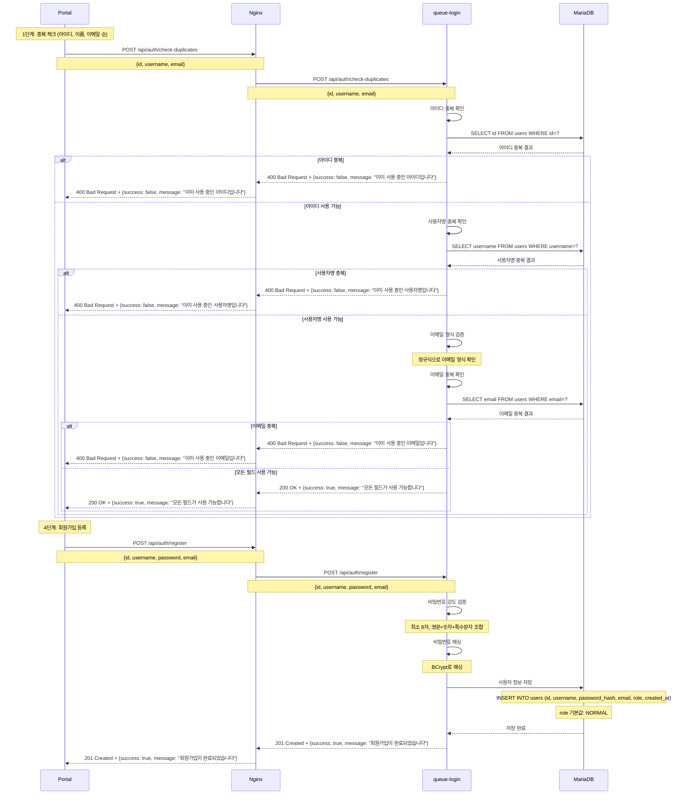
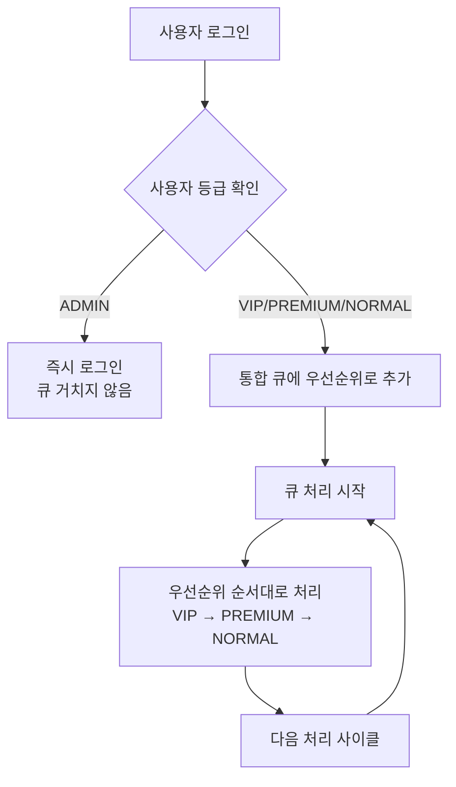
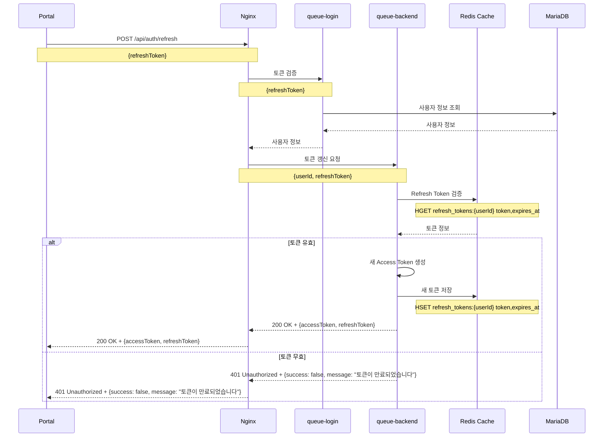
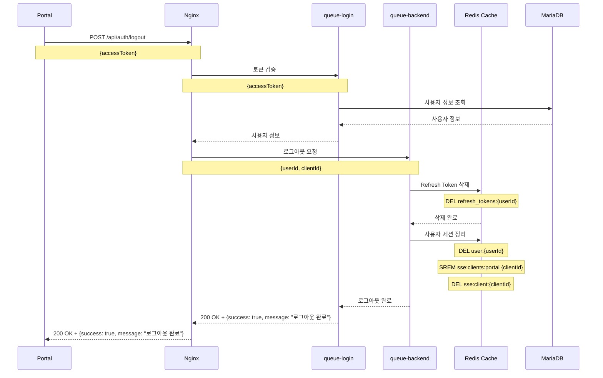

# 큐 시스템 Usecase 문서

## 목차

### Phase 1: 기본 인증 시스템 (현재)
- [1.1 사용자 회원가입](#11-사용자-회원가입)
- [1.2 사용자 로그인 (큐 시스템 통합)](#12-사용자-로그인-큐-시스템-통합)
- [1.3 토큰 갱신](#13-토큰-갱신)
- [1.4 사용자 로그아웃](#14-사용자-로그아웃)

### Phase 2: 큐 시스템 (개발 예정)
- [2.1 큐 입장](#21-큐-입장)
- [2.2 큐 대기](#22-큐-대기)
- [2.3 큐 퇴장](#23-큐-퇴장)
- [2.4 큐 상태 조회](#24-큐-상태-조회)

### Phase 3: 게임 서비스 (개발 예정)
- [3.1 게임 접속](#31-게임-접속)
- [3.2 게임 플레이](#32-게임-플레이)
- [3.3 게임 종료](#33-게임-종료)

---

## Phase 1: 기본 인증 시스템

### 1.1 사용자 회원가입

#### 데이터 흐름


### 1.2 사용자 로그인 (큐 시스템 통합)

#### 통합 로그인 플로우 (5가지 시나리오)

```mermaid
sequenceDiagram
    participant C as Portal
    participant NGINX as Nginx
    participant LOGIN as queue-login
    participant BACKEND as queue-backend
    participant REDIS as Redis Cache
    participant MQTT as MQTT Broker
    participant DB as MariaDB
    
    C->>NGINX: POST /api/auth/login
    Note over C,NGINX: {id, password}
    Note over C,NGINX: Headers: {User-Agent, X-Forwarded-For}
    
    NGINX->>LOGIN: POST /api/auth/login
    Note over NGINX,LOGIN: {id, password}
    Note over NGINX,LOGIN: Headers: {User-Agent, X-Forwarded-For}
    LOGIN->>DB: 사용자 정보 조회
    DB-->>LOGIN: 사용자 정보
    
    LOGIN->>LOGIN: 아이디, 패스워드 검증
    
    alt 🔴 시나리오 2: 인증 실패
        LOGIN->>LOGIN: 실패 로그 기록
        LOGIN-->>NGINX: 400 Bad Request + {success: false, message: "인증 실패"}
        NGINX-->>C: 400 Bad Request + {success: false, message: "인증 실패"}
        
    else 🟢 시나리오 1: 인증 성공
        LOGIN->>LOGIN: 클라이언트 식별자 생성
        Note over LOGIN: clientId = hash(User-Agent + sessionId + userId)
        Note over LOGIN: 동일한 기기에서 재시도 시 같은 clientId 생성
        
        LOGIN->>BACKEND: POST /api/session/check
        Note over LOGIN,BACKEND: {userId, clientId}
        BACKEND->>REDIS: 기존 세션 조회
        Note over REDIS: HGET user:{userId} status, clientId, ticketId
        REDIS-->>BACKEND: 세션 정보
        BACKEND-->>LOGIN: {hasExistingSession: true/false, sessionInfo}
        
        alt 기존 접속 정보 있음 (hasExistingSession == true)
            Note over LOGIN: F5 새로고침 등으로 이미 로그인된 상태
            LOGIN->>LOGIN: JWT 토큰 생성
            Note over LOGIN: accessToken, refreshToken 생성
            LOGIN->>BACKEND: POST /api/session/token
            BACKEND->>REDIS: token 저장
            LOGIN-->>NGINX: 200 OK + {accessToken, refreshToken, role}
            NGINX-->>C: 200 OK + {accessToken, refreshToken, role}
            Note over C: 메인 페이지로 바로 이동 (큐 거치지 않음)
            
        else 기존 접속 정보 없음 (hasExistingSession == false)
            LOGIN->>LOGIN: 사용자 등급 확인
            Note over LOGIN: role: ADMIN, VIP, PREMIUM, NORMAL
            
            alt 🔴 ADMIN 사용자
                Note over LOGIN: 큐를 거치지 않고 바로 로그인
                LOGIN->>LOGIN: JWT 토큰 생성
                Note over LOGIN: accessToken, refreshToken 생성
                LOGIN->>BACKEND: POST /api/session/token
                BACKEND->>REDIS: token 저장
                Note over LOGIN,BACKEND: {userId, accessToken, refreshToken, expiresAt, role}
                LOGIN-->>NGINX: 200 OK + {accessToken, refreshToken, role: "ADMIN"}
                NGINX-->>C: 200 OK + {accessToken, refreshToken, role: "ADMIN"}
                Note over C: 관리자는 즉시 메인 페이지로 이동
            
            else 🟡 VIP, PREMIUM, NORMAL 사용자
                LOGIN->>LOGIN: 우선순위 계산
                Note over LOGIN: VIP=1, PREMIUM=2, NORMAL=3
                LOGIN->>BACKEND: POST /api/queue/join
                Note over LOGIN,BACKEND: {userId, clientId, priority, queueType: "portal"}
            
                BACKEND->>REDIS: 대기열 조회
                Note over BACKEND: 기존 대기열 상태 조회
                Note over REDIS: HGET user:{userId} status, clientId, ticketId
                REDIS-->>BACKEND: 대기열내 존재여부 반환 
            
                alt 🟢 시나리오 1: 큐에 없는 경우
                    BACKEND->>REDIS: 신규 큐 입장
                    Note over REDIS: ZADD queue:portal {priority * 1000000000 + timestamp} {userId}
                    Note over REDIS: VIP=1, PREMIUM=2, NORMAL=3 (낮을수록 높은 우선순위)
                    Note over REDIS: HSET user:{userId} status "PENDING", clientId {clientId}
                    REDIS-->>BACKEND: 큐 입장 완료
                    BACKEND-->>LOGIN: 200 OK + {tid, clientId, queueType: "portal"}
                    LOGIN-->>NGINX: 200 OK + {tid, clientId, queueType: "portal"}
                    NGINX-->>C: 200 OK + {tid, clientId, queueType: "portal"}
                    
                else 🟡 시나리오 3: 같은 클라이언트 재접속
                    Note over BACKEND: 새 clientId == 기존 clientId
                    BACKEND->>REDIS: 기존 큐 위치 유지
                    Note over REDIS: HSET user:{userId} clientId {clientId}, lastSeen {timestamp}
                    REDIS-->>BACKEND: 업데이트 완료
                    BACKEND-->>LOGIN: 200 OK + {기존 tid, clientId, queueType: "portal"}
                    LOGIN-->>NGINX: 200 OK + {기존 tid, clientId, queueType: "portal"}
                    NGINX-->>C: 200 OK + {기존 tid, clientId, queueType: "portal"}
                
                else 🟠 시나리오 4: 만료 (10분 초과)
                    Note over BACKEND: 기존 세션 만료됨
                    BACKEND->>REDIS: 신규 큐 입장
                    Note over REDIS: ZADD queue:portal {priority * 1000000000 + timestamp} {userId}
                    Note over REDIS: VIP=1, PREMIUM=2, NORMAL=3 (낮을수록 높은 우선순위)
                    Note over REDIS: HSET user:{userId} status "PENDING", clientId {clientId}
                    REDIS-->>BACKEND: 큐 입장 완료
                    BACKEND-->>LOGIN: 200 OK + {기존 tid, clientId, queueType: "portal"}
                    LOGIN-->>NGINX: 200 OK + {tid, clientId, queueType: "portal"}
                    NGINX-->>C: 200 OK + {tid, clientId, queueType: "portal"}
            
                else 🔵 시나리오 5: 다른 클라이언트 접속 (기존 클라이언트 튕김)
                    Note over BACKEND: 새 clientId != 기존 clientId
                    
                    BACKEND->>MQTT: MQTT 메시지 발행
                    Note over MQTT: Topic: queue/portal/{userId}/cancelled
                    Note over MQTT: Payload: {clientId: "client_old123", event: "QUEUE_CANCELLED", reason: "다른 클라이언트에서 로그인"}
                    MQTT-->>C: QUEUE_CANCELLED 메시지 수신 (기존 클라이언트)
                    Note over C: {event: "QUEUE_CANCELLED", reason: "다른 클라이언트에서 로그인"}
                                
                    BACKEND->>REDIS: 기존 티켓 ID 유지, 새 clientId로 업데이트
                    Note over REDIS: HSET ticket:tid_abc123 clientId {clientId}
                    Note over REDIS: HSET user:{userId} clientId {clientId}, lastSeen {timestamp}
                    REDIS-->>BACKEND: 업데이트 완료
                    BACKEND-->>LOGIN: 200 OK + {기존 tid, clientId, queueType: "portal"}
                    LOGIN-->>NGINX: 200 OK + {기존 tid, clientId, queueType: "portal"}
                    NGINX-->>C: 200 OK + {기존 tid, clientId, queueType: "portal"}
                end
            end
            
            Note over C: 큐 대기 시작
            
            Note over C,MQTT: 공통 큐 대기 및 토큰 발급 플로우
            C->>MQTT: MQTT 연결 및 구독
            Note over C,MQTT: Topic: queue/portal/{userId}/status
            MQTT-->>C: 연결 성공
            
            Note over BACKEND: 큐 상태 변경 감지 및 MQTT 발행
            BACKEND->>REDIS: 현재 큐 위치 조회
            Note over REDIS: ZRANK queue:portal {userId}, ZCARD queue:portal
            REDIS-->>BACKEND: {position, status, estimatedWait, totalWaiting}
            BACKEND->>MQTT: MQTT 메시지 발행
            Note over MQTT: Topic: queue/portal/{userId}/status
            Note over MQTT: Payload: {position: 10000, estimatedWaitSec: 1020, totalWaiting: 10000}
            MQTT-->>C: QUEUE_UPDATE 메시지 수신
            Note over C: {position: 10000, estimatedWaitSec: 1020, totalWaiting: 10000}
            
            Note over BACKEND: ... (계속 상태 변경 감지)
            BACKEND->>REDIS: 현재 큐 위치 조회
            REDIS-->>BACKEND: {position, status, estimatedWait, totalWaiting}
            BACKEND->>MQTT: MQTT 메시지 발행
            Note over MQTT: Payload: {position: 8800, estimatedWaitSec: 900, totalWaiting: 10150}
            MQTT-->>C: QUEUE_UPDATE 메시지 수신
            Note over C: {position: 8800, estimatedWaitSec: 900, totalWaiting: 10150}
            
            Note over BACKEND: ... (계속 상태 변경 감지)
            BACKEND->>REDIS: 현재 큐 위치 조회
            REDIS-->>BACKEND: {position, status, estimatedWait, totalWaiting}
            BACKEND->>MQTT: MQTT 메시지 발행
            Note over MQTT: Payload: {position: 7000, estimatedWaitSec: 720, totalWaiting: 10200}
            MQTT-->>C: QUEUE_UPDATE 메시지 수신
            Note over C: {position: 7000, estimatedWaitSec: 720, totalWaiting: 10200}
            
            Note over BACKEND: ... (계속 상태 변경 감지)
            BACKEND->>REDIS: 현재 큐 위치 조회
            REDIS-->>BACKEND: {position, status, estimatedWait, totalWaiting}
            BACKEND->>MQTT: MQTT 메시지 발행
            Note over MQTT: Payload: {position: 5200, estimatedWaitSec: 540, totalWaiting: 10180}
            MQTT-->>C: QUEUE_UPDATE 메시지 수신
            Note over C: {position: 5200, estimatedWaitSec: 540, totalWaiting: 10180}
            
            Note over BACKEND: ... (계속 상태 변경 감지)
            BACKEND->>REDIS: 현재 큐 위치 조회
            REDIS-->>BACKEND: {position, status, estimatedWait, totalWaiting}
            BACKEND->>MQTT: MQTT 메시지 발행
            Note over MQTT: Payload: {position: 2800, estimatedWaitSec: 300, totalWaiting: 10100}
            MQTT-->>C: QUEUE_UPDATE 메시지 수신
            Note over C: {position: 2800, estimatedWaitSec: 300, totalWaiting: 10100}
            
            Note over BACKEND: ... (계속 상태 변경 감지)
            BACKEND->>REDIS: 현재 큐 위치 조회
            REDIS-->>BACKEND: {position, status, estimatedWait, totalWaiting}
            BACKEND->>MQTT: MQTT 메시지 발행
            Note over MQTT: Payload: {position: 100, estimatedWaitSec: 30, totalWaiting: 10020}
            MQTT-->>C: QUEUE_UPDATE 메시지 수신
            Note over C: {position: 100, estimatedWaitSec: 30, totalWaiting: 10020}
            
            Note over BACKEND: 대기 완료 조건 확인
            Note over BACKEND: 1. 현재 위치가 처리 가능 범위 내 (예: 상위 100명)
            Note over BACKEND: 2. 동시 접근 가능 인원 이내 (예: 50명/초)
            
            alt 대기 완료 조건 만족
                Note over BACKEND: 대기 완료
                BACKEND->>MQTT: MQTT 메시지 발행
                Note over MQTT: Topic: queue/portal/{userId}/ready
                Note over MQTT: Payload: {status: "READY", message: "대기 완료"}
                MQTT-->>C: QUEUE_READY 메시지 수신
                Note over C: {status: "READY", message: "대기 완료"}
            else 대기 완료 조건 미만족
                Note over BACKEND: 계속 대기 (다음 상태 변경에서 재확인)
            end
                
            C->>NGINX: POST /api/auth/finalize
            Note over C,NGINX: {tid, clientId}
            NGINX->>LOGIN: POST /api/auth/finalize
            Note over NGINX,LOGIN: {tid, clientId}
            LOGIN->>LOGIN: 사용자 정보 조회 (이미 캐시됨)
            LOGIN->>LOGIN: JWT 토큰 생성
            LOGIN->>BACKEND: POST /api/session/token
            Note over LOGIN,BACKEND: {userId, accessToken, refreshToken, expiresAt, role}
            LOGIN->>BACKEND: POST /api/queue/complete
            Note over LOGIN,BACKEND: {userId, ticketId}
            Note over BACKEND: 큐에서 사용자 제거, 상태 업데이트
            LOGIN-->>NGINX: 200 OK + {accessToken, refreshToken}
            NGINX-->>C: 200 OK + {accessToken, refreshToken}
            
            Note over C: 메인 페이지로 이동 (JWT 토큰 사용)
        end
    end
```


#### 시나리오별 설명
- **🟢 시나리오 1**: 정상 로그인 플로우 (신규 로그인)
- **🔴 시나리오 2**: 로그인 실패 플로우 (인증 실패)
- **🟡 시나리오 3**: 포털 튕김 후 10분 내 재접속 (기존 큐 유지)
- **🟠 시나리오 4**: 포털 튕김 후 10분 후 재접속 (신규 큐 등록)
- **🔵 시나리오 5**: 다른 클라이언트 접속 시 기존 클라이언트 튕김 (기존 큐 유지)

#### 사용자 등급별 처리
- **ADMIN**: 관리자 (즉시 로그인, 큐 거치지 않음)
- **VIP**: VIP 사용자 (가장 높은 우선순위)
- **PREMIUM**: 프리미엄 사용자 (VIP 다음 우선순위)
- **NORMAL**: 일반 사용자 (기본 우선순위)

#### SSE 폴링 방식
- **폴링 주기**: 5-30초마다 Redis 조회
- **조회 내용**: 
  - `ZRANK queue:portal {userId}`: 현재 큐 위치
  - `ZCARD queue:portal`: 전체 대기 인원 수
  - `ZRANGE queue:portal 0 0`: 다음 처리될 사용자
- **업데이트 조건**: 큐 위치나 상태가 변경된 경우에만 SSE 전송
- **성능 최적화**: 변경사항이 없으면 SSE 전송 생략

#### 대기 완료 기준
- **위치 기준**: 현재 큐 위치가 처리 가능 범위 내 (예: 상위 100명)
- **처리 용량**: 동시 접근 가능 인원 이내 (예: 50명/초)
- **서버 상태**: 서버 처리 용량 여유 있음
- **우선순위**: VIP > PREMIUM > NORMAL 순서로 처리
- **실시간 계산**: 
  ```
  처리 가능 여부 = (현재 위치 <= 처리 가능 범위) && 
                   (동시 접근 인원 < 최대 처리 용량) && 
                   (서버 상태 == 정상)
  ```

#### 큐 처리 우선순위


### 1.3 토큰 갱신

#### 데이터 흐름


### 1.4 사용자 로그아웃

#### 데이터 흐름


---

## Phase 2: 큐 시스템 (개발 예정)

### 2.1 큐 입장
사용자가 큐에 입장하여 대기열에 등록하는 과정

### 2.2 큐 대기  
실시간으로 큐 상태를 모니터링하며 대기하는 과정

### 2.3 큐 퇴장
사용자가 큐에서 나가는 과정

### 2.4 큐 상태 조회
현재 큐 위치와 예상 대기 시간을 조회하는 과정

---

## Phase 3: 게임 서비스 (개발 예정)

### 3.1 게임 접속
큐 대기 완료 후 게임에 접속하는 과정

### 3.2 게임 플레이
게임을 플레이하는 과정

### 3.3 게임 종료
게임을 종료하고 포털로 돌아가는 과정

---

## 관련 문서
- **시스템 아키텍처**: [SystemArchitecture.md](./SystemArchitecture.md)
- **Redis 데이터 구조**: [queue-backend/docs/Redis_Data_Structure.md](../queue-backend/docs/Redis_Data_Structure.md)
- **JWT 토큰 관리**: [queue-backend/docs/JWT_Token_Management.md](../queue-backend/docs/JWT_Token_Management.md)
- **MQTT 이벤트 타입**: [queue-backend/docs/MQTT_Event_Types.md](../queue-backend/docs/MQTT_Event_Types.md)